-   [Purpose](#purpose)
-   [Preparing Stock Symbol Information](#preparing-stock-symbol-information)
    -   [Stock Symbol Datasets](#stock-symbol-datasets)
    -   [All Country World Index (ACWI) Closing Prices](#all-country-world-index-acwi-closing-prices)
-   [Downloading & Cleaning Stock Financial Data via `quantmod`](#downloading-cleaning-stock-financial-data-via-quantmod)
    -   ['Cleaning' Stocks](#cleaning-stocks)
    -   [Column Names:](#column-names)
    -   [Data Summary:](#data-summary)
-   [Exploring Data](#exploring-data)
    -   [Collinearity](#collinearity)
    -   [Correlation, Maximal Information Coefficient](#correlation-maximal-information-coefficient)
    -   [Looking at Data](#looking-at-data)
    -   [Segmentation and Clustering](#segmentation-and-clustering)
-   [Sandbox / TODO](#sandbox-todo)
-   [Datasets](#datasets)
-   [Spot Check](#spot-check)
-   [Regression](#regression)
-   [Assumptions, Considerations, and Notes](#assumptions-considerations-and-notes)

Purpose
=======

> The main goal of this project is to work through a real-world example of **gathering**, **cleaning**, and **exploring** data, and using that data along with **machine learning** techniques to predict stock price gains and losses.
>
> And more specifically, to compare those gains/losses against the market as a whole, in order to see if we can consistently beat the market with a portfolio of select stocks, based primarily on the quarterly or annual `financial information` of those stocks.

-   secondary goals include:
    -   having a *custom* sample project to implement new data analysis and machine learning techniques that I've learned.
        -   a financial/stock project seemed reasonable since it would contain data that I can use for basic data analysis, prediction, and time series.
        -   **consequently, this project may contain sections where a particular analysis technique is redundant given previous data analysis techniques already applied in the project, but is included for my own learning purposes.**

Preparing Stock Symbol Information
==================================

-   stock symbols found at [Nasdaq.com](http://www.nasdaq.com/screening/company-list.aspx)
-   stock information downloaded using [quantmod](https://cran.r-project.org/web/packages/quantmod/quantmod.pdf)

Stock Symbol Datasets
---------------------

These stock symbols will be used to download the financials using `quantmod`.

``` r
head(df_nasdaq_symbols)
```

    ## # A tibble: 6 × 2
    ##                                     name symbol
    ##                                    <chr>  <chr>
    ## 1                1-800 FLOWERS.COM, Inc.   FLWS
    ## 2 1347 Property Insurance Holdings, Inc.    PIH
    ## 3          1st Constitution Bancorp (NJ)   FCCY
    ## 4                 1st Source Corporation   SRCE
    ## 5                   21Vianet Group, Inc.   VNET
    ## 6                               2U, Inc.   TWOU

``` r
head(df_nyse_symbols)
```

    ##   symbol                   Name LastSale MarketCap IPOyear            Sector                                        industry                     Summary.Quote
    ## 1    DDD 3D Systems Corporation    13.28    $1.49B     n/a        Technology         Computer Software: Prepackaged Software  http://www.nasdaq.com/symbol/ddd
    ## 2    MMM             3M Company   172.63  $103.83B     n/a       Health Care                      Medical/Dental Instruments  http://www.nasdaq.com/symbol/mmm
    ## 3   WBAI        500.com Limited     13.4  $556.07M    2013 Consumer Services           Services-Misc. Amusement & Recreation http://www.nasdaq.com/symbol/wbai
    ## 4   WUBA            58.com Inc.    30.38     $4.4B    2013        Technology Computer Software: Programming, Data Processing http://www.nasdaq.com/symbol/wuba
    ## 5    AHC  A.H. Belo Corporation     6.15  $133.31M     n/a Consumer Services                            Newspapers/Magazines  http://www.nasdaq.com/symbol/ahc
    ## 6   ATEN     A10 Networks, Inc.     7.93  $532.94M    2014        Technology               Computer Communications Equipment http://www.nasdaq.com/symbol/aten

``` r
head(df_amex_symbols)
```

    ##           symbol                                                           Name LastSale MarketCap IPOyear                Sector              industry
    ## 1           XXII                                        22nd Century Group, Inc    0.935    $84.8M     n/a Consumer Non-Durables Farming/Seeds/Milling
    ## 2            FAX                          Aberdeen Asia-Pacific Income Fund Inc     4.71    $1.21B    1986                   n/a                   n/a
    ## 3            IAF                             Aberdeen Australia Equity Fund Inc     5.78   $131.6M     n/a                   n/a                   n/a
    ## 4             CH                                      Aberdeen Chile Fund, Inc.     6.16   $57.82M     n/a                   n/a                   n/a
    ## 5 ABE            Aberdeen Emerging Markets Smaller Company Opportunities Fund I  11.2686  $109.06M     n/a                   n/a                   n/a
    ## 6            FCO                              Aberdeen Global Income Fund, Inc.     7.86   $68.89M    1992                   n/a                   n/a
    ##                       Summary.Quote
    ## 1 http://www.nasdaq.com/symbol/xxii
    ## 2  http://www.nasdaq.com/symbol/fax
    ## 3  http://www.nasdaq.com/symbol/iaf
    ## 4   http://www.nasdaq.com/symbol/ch
    ## 5  http://www.nasdaq.com/symbol/abe
    ## 6  http://www.nasdaq.com/symbol/fco

All Country World Index (ACWI) Closing Prices
---------------------------------------------

We will use the `All Country World Index` (`ACWI`) [closing prices](https://finance.yahoo.com/quote/ACWI?p=ACWI) to compare our stocks against (and trying to beat) with machine learning predictions. That is, we want to be able to select stocks that will outperform the market (i.e. `ACWI`) after 1 year from the release of the financial data.

According to [Investipedia](http://www.investopedia.com/terms/m/msci-acwi.asp), the ACWI is:

> a market capitalization weighted index designed to provide a broad measure of equity-market performance throughout the world. The MSCI ACWI is maintained by Morgan Stanley Capital International, and is comprised of stocks from both developed and emerging markets.

``` r
head(acwi_closing)
```

    ## # A tibble: 6 × 6
    ##         date close close_lag_year close_moving_ave close_lag_year_moving_ave perc_change_1year
    ##       <date> <dbl>          <dbl>            <dbl>                     <dbl>             <dbl>
    ## 1 2017-02-28 62.42             NA          61.4372                        NA                NA
    ## 2 2017-02-27 62.63             NA          61.3936                        NA                NA
    ## 3 2017-02-26 62.58             NA          61.3486                        NA                NA
    ## 4 2017-02-25 62.58             NA          61.3046                        NA                NA
    ## 5 2017-02-24 62.58             NA          61.2606                        NA                NA
    ## 6 2017-02-23 62.74             NA          61.2164                        NA                NA

``` r
tail(acwi_closing)
```

    ## # A tibble: 6 × 6
    ##         date    close close_lag_year close_moving_ave close_lag_year_moving_ave perc_change_1year
    ##       <date>    <dbl>          <dbl>            <dbl>                     <dbl>             <dbl>
    ## 1 2008-04-02 43.19398       25.43898               NA                        NA                NA
    ## 2 2008-04-01 42.72163       24.46056               NA                        NA                NA
    ## 3 2008-03-31 41.59982       23.89544               NA                        NA                NA
    ## 4 2008-03-30 42.25773       23.44840               NA                        NA                NA
    ## 5 2008-03-29 42.25773       24.37621               NA                        NA                NA
    ## 6 2008-03-28 42.25773       24.37621               NA                        NA                NA

Downloading & Cleaning Stock Financial Data via `quantmod`
==========================================================

-   downloads stock financials statements using `quantmod` library, saves them into partitions that contain up to 100 stocks per partition (some stocks will not be found)
-   converts format of data returned by `quantmod` from various lists of financial statements to a single dataframes
-   changes column names into valid and consistent values (e.g. removes punctuation)
-   calculates various fields financial ratios and formats data so that rows (i.e. years) have that year's data as well as specific information for the following year in order to use those fields as target variables to be predicted (such as net profit margin, next year's stock prices, etc.)
    -   removes stocks that are missing a certain threshold of information.

'Cleaning' Stocks
-----------------

Removing variables that have mostly a) missing variables, b) variables that are very unlikely to contribute to model and more likely to create noise, and c) are duplicated and/or very highly correlated to other variables:

> OtherRevenueTotal, DepreciationAmortization, InterestExpenseIncomeNetOperating, OtherOperatingExpensesTotal, InterestIncomeExpenseNetNonOperating, GainLossonSaleofAssets, OtherNet, MinorityInterestx, EquityInAffiliates, AccountingChange, DiscontinuedOperations, ExtraordinaryItem, PreferredDividends, BasicWeightedAverageShares, BasicEPSExcludingExtraordinaryItems, BasicEPSIncludingExtraordinaryItems, DilutionAdjustment, DilutedEPSIncludingExtraordinaryItems, GrossDividendsCommonStock, NetIncomeafterStockBasedCompExpense, BasicEPSafterStockBasedCompExpense, DilutedEPSafterStockBasedCompExpense, DepreciationSupplemental, TotalSpecialItems, NormalizedIncomeBeforeTaxes, EffectofSpecialItemsonIncomeTaxes, IncomeTaxesExImpactofSpecialItems, NormalizedIncomeAfterTaxes, NormalizedIncomeAvailtoCommon, BasicNormalizedEPS, ShortTermInvestments, ReceivablesOther, LongTermInvestments, CurrentPortofLTDebtCapitalLeases, CapitalLeaseObligations, DeferredIncomeTax, MinorityInteresty, TreasuryStockCommon, OtherEquityTotal, SharesOutsCommonStockPrimaryIssue, Amortization, IssuanceRetirementofStockNet, IssuanceRetirementofDebtNet, ForeignExchangeEffects

Removing `340` symbols (out of `3069`, or 11.1%) that have &gt;= 12.5% of variables (i.e. financial data) with `NA` values.

Removing `1498` symbols (out of `2729`, or 54.9%) that have 'odd' data and/or stocks that I'm not likely to invest in anyway (e.g. less than $5 historical median stock price)

Removing variables that have mostly have &gt;= 20% data missing:

> UnusualExpenseIncome, PrepaidExpenses, RedeemablePreferredStockTotal, PreferredStockNonRedeemableNet, TotalCashDividendsPaid

> Using KNN Imputation to fill missing values for remaining data.

> `1231` unique stocks.

Column Names:
-------------

``` r
column_names = colnames(df_stocks_full)
kable(data_frame(num=(1:length(column_names)), colname_names=column_names))
```

|  num| colname\_names                              |
|----:|:--------------------------------------------|
|    1| date                                        |
|    2| symbol                                      |
|    3| perc\_change\_stock\_1year                  |
|    4| diff\_above\_index\_1year                   |
|    5| Revenue                                     |
|    6| TotalRevenue                                |
|    7| CostofRevenueTotal                          |
|    8| GrossProfit                                 |
|    9| SellingGeneralAdminExpensesTotal            |
|   10| ResearchDevelopment                         |
|   11| TotalOperatingExpense                       |
|   12| OperatingIncome                             |
|   13| IncomeBeforeTax                             |
|   14| IncomeAfterTax                              |
|   15| NetIncomeBeforeExtraItems                   |
|   16| NetIncome                                   |
|   17| IncomeAvailabletoCommonExclExtraItems       |
|   18| IncomeAvailabletoCommonInclExtraItems       |
|   19| DilutedWeightedAverageShares                |
|   20| DilutedEPSExcludingExtraordinaryItems       |
|   21| DividendsperShareCommonStockPrimaryIssue    |
|   22| DilutedNormalizedEPS                        |
|   23| CashEquivalents                             |
|   24| CashandShortTermInvestments                 |
|   25| AccountsReceivableTradeNet                  |
|   26| TotalReceivablesNet                         |
|   27| TotalInventory                              |
|   28| OtherCurrentAssetsTotal                     |
|   29| TotalCurrentAssets                          |
|   30| PropertyPlantEquipmentTotalGross            |
|   31| AccumulatedDepreciationTotal                |
|   32| GoodwillNet                                 |
|   33| IntangiblesNet                              |
|   34| OtherLongTermAssetsTotal                    |
|   35| TotalAssets                                 |
|   36| AccountsPayable                             |
|   37| AccruedExpenses                             |
|   38| NotesPayableShortTermDebt                   |
|   39| OtherCurrentliabilitiesTotal                |
|   40| TotalCurrentLiabilities                     |
|   41| LongTermDebt                                |
|   42| TotalLongTermDebt                           |
|   43| TotalDebt                                   |
|   44| OtherLiabilitiesTotal                       |
|   45| TotalLiabilities                            |
|   46| CommonStockTotal                            |
|   47| AdditionalPaidInCapital                     |
|   48| RetainedEarningsAccumulatedDeficit          |
|   49| TotalEquity                                 |
|   50| TotalLiabilitiesShareholders39Equity        |
|   51| TotalCommonSharesOutstanding                |
|   52| NetIncomeStartingLine                       |
|   53| DepreciationDepletion                       |
|   54| DeferredTaxes                               |
|   55| NonCashItems                                |
|   56| ChangesinWorkingCapital                     |
|   57| CashfromOperatingActivities                 |
|   58| CapitalExpenditures                         |
|   59| OtherInvestingCashFlowItemsTotal            |
|   60| CashfromInvestingActivities                 |
|   61| FinancingCashFlowItems                      |
|   62| CashfromFinancingActivities                 |
|   63| NetChangeinCash                             |
|   64| CashInterestPaidSupplemental                |
|   65| CashTaxesPaidSupplemental                   |
|   66| net\_profit\_margin                         |
|   67| cs\_current\_assets                         |
|   68| cs\_cash\_short\_term\_investments          |
|   69| cs\_accounts\_receivable                    |
|   70| cs\_inventories                             |
|   71| cs\_goodwill                                |
|   72| cs\_current\_liabilities                    |
|   73| cs\_accounts\_payable                       |
|   74| cs\_long\_term\_debt                        |
|   75| cs\_total\_liabilities\_debt                |
|   76| cs\_cost\_of\_goods\_sold                   |
|   77| cs\_gross\_profit                           |
|   78| cs\_rd                                      |
|   79| cs\_income\_from\_operations                |
|   80| cs\_net\_income                             |
|   81| cs\_shareholders\_equity                    |
|   82| cs\_cash\_flow\_from\_operatons             |
|   83| cs\_capital\_expenditures                   |
|   84| ratios\_current\_ratio                      |
|   85| ratios\_quick\_ratio                        |
|   86| ratios\_cash\_ratio                         |
|   87| ratios\_debt\_to\_total\_assets             |
|   88| ratios\_long\_term\_debt\_to\_total\_assets |
|   89| ratios\_cash\_flow\_to\_total\_debt         |
|   90| ratios\_debt\_to\_equity                    |
|   91| ratios\_equity\_multiplier                  |
|   92| ratios\_intangible\_assets                  |
|   93| ratios\_rd\_as\_perc\_revenue               |
|   94| ratios\_gross\_profit\_margin               |
|   95| ratios\_operating\_profit\_margin           |
|   96| ratios\_net\_profit\_margin                 |
|   97| ratios\_income\_to\_assets                  |
|   98| ratios\_income\_to\_equity                  |
|   99| ratioh\_current\_ratio                      |
|  100| ratioh\_quick\_ratio                        |
|  101| ratioh\_cash\_ratio                         |
|  102| ratioh\_debt\_to\_equity                    |
|  103| ratioh\_intangible\_asset\_ratio            |
|  104| ratioh\_gross\_profit\_margin               |
|  105| ratioh\_net\_profit\_margin                 |
|  106| ratioh\_income\_to\_equity                  |

Data Summary:
-------------

> **NOTE**: all numbers, regardless of source (yahoo/google), look to be in `millions`. I have confirmed over multiple stocks/sources (but this can/should be further confirmed).

``` r
summary(df_stocks_full)
```

          date               symbol          perc_change_stock_1year diff_above_index_1year    Revenue          TotalRevenue      CostofRevenueTotal  GrossProfit       
     Min.   :2010-09-30   Length:4328        Min.   :-0.79865        Min.   :-0.81812       Min.   :   100.5   Min.   :   100.5   Min.   :     1.1   Min.   :    15.72  
     1st Qu.:2013-09-30   Class :character   1st Qu.:-0.05028        1st Qu.:-0.10321       1st Qu.:   701.2   1st Qu.:   701.2   1st Qu.:   366.5   1st Qu.:   269.87  
     Median :2014-06-30   Mode  :character   Median : 0.13153        Median : 0.05420       Median :  2132.3   Median :  2144.9   Median :  1165.7   Median :   784.58  
     Mean   :2014-07-06                      Mean   : 0.16080        Mean   : 0.08457       Mean   : 11839.1   Mean   : 11858.4   Mean   :  7128.3   Mean   :  4773.80  
     3rd Qu.:2015-04-24                      3rd Qu.: 0.32600        3rd Qu.: 0.23512       3rd Qu.:  6956.5   3rd Qu.:  6962.8   3rd Qu.:  4270.1   3rd Qu.:  2453.08  
     Max.   :2016-01-03                      Max.   : 2.90047        Max.   : 2.67366       Max.   :485651.0   Max.   :485651.0   Max.   :365086.0   Max.   :291370.00  
     SellingGeneralAdminExpensesTotal ResearchDevelopment TotalOperatingExpense OperatingIncome     IncomeBeforeTax     IncomeAfterTax     NetIncomeBeforeExtraItems   NetIncome       
     Min.   :     3.29                Min.   :    0.00    Min.   :    71.0      Min.   :-30613.00   Min.   :-28695.00   Min.   :-4659.73   Min.   :-4946.9           Min.   :    0.04  
     1st Qu.:   121.74                1st Qu.:    0.00    1st Qu.:   594.3      1st Qu.:    71.58   1st Qu.:    62.96   1st Qu.:   43.74   1st Qu.:   43.2           1st Qu.:   43.86  
     Median :   345.83                Median :    0.00    Median :  1829.7      Median :   237.55   Median :   200.21   Median :  144.10   Median :  139.7           Median :  141.55  
     Mean   :  2086.54                Mean   :  270.13    Mean   : 10231.9      Mean   :  1626.43   Mean   :  1555.27   Mean   : 1155.66   Mean   : 1125.4           Mean   : 1151.41  
     3rd Qu.:  1112.29                3rd Qu.:   31.11    3rd Qu.:  6084.8      3rd Qu.:   831.45   3rd Qu.:   723.50   3rd Qu.:  516.52   3rd Qu.:  505.5           3rd Qu.:  512.96  
     Max.   :151531.00                Max.   :36004.00    Max.   :458504.0      Max.   :105702.00   Max.   :111683.00   Max.   :87059.00   Max.   :86528.0           Max.   :86528.00  
     IncomeAvailabletoCommonExclExtraItems IncomeAvailabletoCommonInclExtraItems DilutedWeightedAverageShares DilutedEPSExcludingExtraordinaryItems
     Min.   :-4946.91                      Min.   : -266.00                      Min.   :     0.7             Min.   : -6.290                      
     1st Qu.:   42.15                      1st Qu.:   42.84                      1st Qu.:    34.3             1st Qu.:  0.930                      
     Median :  136.47                      Median :  137.68                      Median :    72.4             Median :  1.750                      
     Mean   : 1118.94                      Mean   : 1145.00                      Mean   :   830.1             Mean   :  3.027                      
     3rd Qu.:  498.39                      3rd Qu.:  507.22                      3rd Qu.:   226.0             3rd Qu.:  3.000                      
     Max.   :86528.00                      Max.   :86528.00                      Max.   :362429.9             Max.   :299.820                      
     DividendsperShareCommonStockPrimaryIssue DilutedNormalizedEPS CashEquivalents     CashandShortTermInvestments AccountsReceivableTradeNet TotalReceivablesNet TotalInventory    
     Min.   :  0.000                          Min.   : -6.210      Min.   :     0.00   Min.   :     0.00           Min.   :    -0.08          Min.   :     0.00   Min.   :    0.00  
     1st Qu.:  0.000                          1st Qu.:  1.008      1st Qu.:    53.59   1st Qu.:    58.15           1st Qu.:    76.19          1st Qu.:    82.16   1st Qu.:   76.04  
     Median :  0.480                          Median :  1.850      Median :   167.17   Median :   197.75           Median :   234.87          Median :   251.22   Median :  212.66  
     Mean   :  0.974                          Mean   :  3.201      Mean   :  1082.34   Mean   :  1999.30           Mean   :  1407.11          Mean   :  1646.07   Mean   :  942.04  
     3rd Qu.:  1.071                          3rd Qu.:  3.210      3rd Qu.:   574.53   3rd Qu.:   734.79           3rd Qu.:   795.64          3rd Qu.:   922.74   3rd Qu.:  620.79  
     Max.   :131.000                          Max.   :301.350      Max.   :111742.00   Max.   :254509.00           Max.   :139159.00          Max.   :150923.00   Max.   :47257.00  
     OtherCurrentAssetsTotal TotalCurrentAssets PropertyPlantEquipmentTotalGross AccumulatedDepreciationTotal  GoodwillNet       IntangiblesNet      OtherLongTermAssetsTotal
     Min.   :    0.00        Min.   :    10.1   Min.   :      0.0                Min.   :-630190.7            Min.   :     0.0   Min.   :    -0.07   Min.   :    0.00        
     1st Qu.:   13.00        1st Qu.:   300.7   1st Qu.:    262.2                1st Qu.:  -1400.6            1st Qu.:    95.5   1st Qu.:    42.79   1st Qu.:   17.01        
     Median :   44.61        Median :   815.9   Median :    853.0                Median :   -408.3            Median :   389.0   Median :   174.28   Median :   65.52        
     Mean   :  469.78        Mean   :  5073.7   Mean   :  10618.1                Mean   :  -5417.8            Mean   :  2438.4   Mean   :  1758.68   Mean   :  806.65        
     3rd Qu.:  174.31        3rd Qu.:  2728.3   3rd Qu.:   2911.9                3rd Qu.:   -133.0            3rd Qu.:  1527.2   3rd Qu.:   617.14   3rd Qu.:  340.51        
     Max.   :79228.00        Max.   :436492.0   Max.   :1015426.0                Max.   :     -0.1            Max.   :104568.0   Max.   :120710.00   Max.   :47923.00        
      TotalAssets       AccountsPayable     AccruedExpenses    NotesPayableShortTermDebt OtherCurrentliabilitiesTotal TotalCurrentLiabilities  LongTermDebt      TotalLongTermDebt  
     Min.   :    36.0   Min.   :     0.00   Min.   :-1284.00   Min.   :    0.0           Min.   :   -4.00             Min.   :     7.21       Min.   :     0.0   Min.   :     0.00  
     1st Qu.:   766.5   1st Qu.:    33.18   1st Qu.:   39.26   1st Qu.:    0.0           1st Qu.:   18.62             1st Qu.:   132.53       1st Qu.:   218.5   1st Qu.:    29.57  
     Median :  2486.5   Median :   118.90   Median :  114.15   Median :    0.0           Median :   70.81             Median :   416.73       Median :   596.0   Median :   490.63  
     Mean   : 16747.3   Mean   :  1167.10   Mean   :  787.93   Mean   :  324.8           Mean   : 1063.19             Mean   :  3793.26       Mean   :  3679.5   Mean   :  3654.49  
     3rd Qu.:  9030.7   3rd Qu.:   460.01   3rd Qu.:  413.99   3rd Qu.:    0.0           3rd Qu.:  368.95             3rd Qu.:  1791.00       3rd Qu.:  2074.1   3rd Qu.:  2060.85  
     Max.   :664362.0   Max.   :122647.00   Max.   :74256.00   Max.   :69231.2           Max.   :63809.00             Max.   :255929.00       Max.   :292844.0   Max.   :292844.00  
       TotalDebt        OtherLiabilitiesTotal TotalLiabilities   CommonStockTotal   AdditionalPaidInCapital RetainedEarningsAccumulatedDeficit  TotalEquity      
     Min.   :     0.0   Min.   :  -48.32      Min.   :   -65.9   Min.   :    0.00   Min.   :  -884.6        Min.   :-104557.2                  Min.   :     2.0  
     1st Qu.:    51.5   1st Qu.:   26.94      1st Qu.:   323.9   1st Qu.:    0.36   1st Qu.:   170.0        1st Qu.:    136.1                  1st Qu.:   373.9  
     Median :   565.4   Median :  119.64      Median :  1335.7   Median :    2.00   Median :   459.3        Median :    586.9                  Median :  1015.0  
     Mean   :  4460.0   Mean   : 1278.70      Mean   :  9739.5   Mean   : 1031.70   Mean   :  3097.6        Mean   :   5231.7                  Mean   :  7007.8  
     3rd Qu.:  2358.8   3rd Qu.:  567.00      3rd Qu.:  5420.3   3rd Qu.:  105.25   3rd Qu.:  1420.3        3rd Qu.:   2216.6                  3rd Qu.:  3396.1  
     Max.   :356323.0   Max.   :56520.00      Max.   :493263.0   Max.   :80932.00   Max.   :184620.1        Max.   : 412444.0                  Max.   :407982.0  
     TotalLiabilitiesShareholders39Equity TotalCommonSharesOutstanding NetIncomeStartingLine DepreciationDepletion DeferredTaxes        NonCashItems       ChangesinWorkingCapital
     Min.   :    36.0                     Min.   :     0.6             Min.   : -580.27      Min.   :    0.31      Min.   :-7991.000   Min.   :-66163.64   Min.   :-32630.00      
     1st Qu.:   766.5                     1st Qu.:    34.0             1st Qu.:   44.81      1st Qu.:   22.92      1st Qu.:   -6.841   1st Qu.:     1.96   1st Qu.:   -64.83      
     Median :  2486.5                     Median :    72.0             Median :  147.72      Median :   74.27      Median :    0.990   Median :    13.39   Median :   -10.29      
     Mean   : 16747.3                     Mean   :   805.8             Mean   : 1240.64      Mean   :  772.36      Mean   :   37.575   Mean   :   181.60   Mean   :  -246.51      
     3rd Qu.:  9030.7                     3rd Qu.:   221.2             3rd Qu.:  530.12      3rd Qu.:  264.91      3rd Qu.:   14.845   3rd Qu.:    62.45   3rd Qu.:    10.81      
     Max.   :664362.0                     Max.   :338468.3             Max.   :90172.00      Max.   :82473.00      Max.   : 9671.000   Max.   : 42813.00   Max.   : 11647.00      
     CashfromOperatingActivities CapitalExpenditures  OtherInvestingCashFlowItemsTotal CashfromInvestingActivities FinancingCashFlowItems CashfromFinancingActivities
     Min.   : -2201.06           Min.   :-102022.00   Min.   :-83315.00                Min.   :-170032.00          Min.   :-62759.00      Min.   :-75346.00          
     1st Qu.:    79.37           1st Qu.:   -359.65   1st Qu.:  -152.61                1st Qu.:   -596.10          1st Qu.:   -12.53      1st Qu.:  -252.10          
     Median :   251.10           Median :    -94.97   Median :   -14.40                Median :   -157.20          Median :    -0.34      Median :   -36.34          
     Mean   :  2053.42           Mean   :  -1123.94   Mean   :  -350.96                Mean   :  -1473.82          Mean   :   -68.77      Mean   :  -474.11          
     3rd Qu.:   891.83           3rd Qu.:    -27.68   3rd Qu.:     3.56                3rd Qu.:    -38.93          3rd Qu.:     3.64      3rd Qu.:    15.94          
     Max.   :159377.00           Max.   :     -0.04   Max.   : 44097.33                Max.   :  36184.38          Max.   : 16566.28      Max.   : 87497.00          
     NetChangeinCash     CashInterestPaidSupplemental CashTaxesPaidSupplemental net_profit_margin   cs_current_assets cs_cash_short_term_investments cs_accounts_receivable
     Min.   :-42930.00   Min.   :-2952.00             Min.   :-13647.00         Min.   :0.0002318   Min.   :0.01544   Min.   :0.00000                Min.   :0.00000       
     1st Qu.:   -29.59   1st Qu.:    3.88             1st Qu.:    11.95         1st Qu.:0.0406755   1st Qu.:0.22959   1st Qu.:0.03272                1st Qu.:0.05613       
     Median :     3.63   Median :   23.23             Median :    41.32         Median :0.0736982   Median :0.41108   Median :0.09323                Median :0.11045       
     Mean   :    95.28   Mean   :  173.92             Mean   :   363.76         Mean   :0.0956484   Mean   :0.41323   Mean   :0.14530                Mean   :0.13199       
     3rd Qu.:    58.92   3rd Qu.:   96.47             3rd Qu.:   158.00         3rd Qu.:0.1237887   3rd Qu.:0.57969   3rd Qu.:0.21061                3rd Qu.:0.17597       
     Max.   : 75148.00   Max.   :24957.00             Max.   : 32648.00         Max.   :1.5452460   Max.   :0.97810   Max.   :0.85475                Max.   :1.34166       
     cs_inventories     cs_goodwill      cs_current_liabilities cs_accounts_payable cs_long_term_debt cs_total_liabilities_debt cs_cost_of_goods_sold cs_gross_profit   
     Min.   :0.00000   Min.   :0.00000   Min.   :0.007781       Min.   :0.00000     Min.   : 0.0000   Min.   :-0.1717           Min.   :0.00289       Min.   :0.004036  
     1st Qu.:0.03688   1st Qu.:0.06689   1st Qu.:0.123666       1st Qu.:0.02475     1st Qu.: 0.1373   1st Qu.: 0.3833           1st Qu.:0.42625       1st Qu.:0.254498  
     Median :0.09555   Median :0.15237   Median :0.185615       Median :0.04968     Median : 0.2507   Median : 0.5345           Median :0.62023       Median :0.388283  
     Mean   :0.13807   Mean   :0.24592   Mean   :0.212364       Mean   :0.07546     Mean   : 0.3513   Mean   : 0.5246           Mean   :0.61060       Mean   :0.447771  
     3rd Qu.:0.18327   3rd Qu.:0.29856   3rd Qu.:0.270541       3rd Qu.:0.09576     3rd Qu.: 0.3855   3rd Qu.: 0.6708           3rd Qu.:0.75671       3rd Qu.:0.586267  
     Max.   :2.25613   Max.   :8.91203   Max.   :0.896142       Max.   :1.40746     Max.   :12.7185   Max.   : 0.9979           Max.   :8.44919       Max.   :7.123093  
         cs_rd         cs_income_from_operations cs_net_income       cs_shareholders_equity cs_cash_flow_from_operatons cs_capital_expenditures ratios_current_ratio ratios_quick_ratio
     Min.   :0.00000   Min.   :-0.20106          Min.   :0.0002318   Min.   :0.002122       Min.   :-0.45393            Min.   :-4.979452       Min.   : 0.136       Min.   : 0.03017  
     1st Qu.:0.00000   1st Qu.: 0.06876          1st Qu.:0.0406755   1st Qu.:0.329180       1st Qu.: 0.07837            1st Qu.:-0.082258       1st Qu.: 1.249       1st Qu.: 0.75550  
     Median :0.00000   Median : 0.11740          Median :0.0736982   Median :0.465544       Median : 0.13169            Median :-0.041856       Median : 1.857       Median : 1.18402  
     Mean   :0.02869   Mean   : 0.14224          Mean   :0.0956484   Mean   :0.475367       Mean   : 0.16079            Mean   :-0.089652       Mean   : 2.315       Mean   : 1.60164  
     3rd Qu.:0.02446   3rd Qu.: 0.18727          3rd Qu.:0.1237887   3rd Qu.:0.616699       3rd Qu.: 0.21916            3rd Qu.:-0.022826       3rd Qu.: 2.810       3rd Qu.: 1.87571  
     Max.   :0.45380   Max.   : 0.67995          Max.   :1.5452460   Max.   :1.171682       Max.   : 1.17776            Max.   :-0.000169       Max.   :32.710       Max.   :32.36178  
     ratios_cash_ratio ratios_debt_to_total_assets ratios_long_term_debt_to_total_assets ratios_cash_flow_to_total_debt ratios_debt_to_equity ratios_equity_multiplier
     Min.   : 0.0000   Min.   :-0.1717             Min.   : 0.0000                       Min.   :-1.1320                Min.   : -0.1465      Min.   :  0.8535        
     1st Qu.: 0.1764   1st Qu.: 0.3833             1st Qu.: 0.1373                       1st Qu.: 0.1263                1st Qu.:  0.6215      1st Qu.:  1.6215        
     Median : 0.4676   Median : 0.5345             Median : 0.2507                       Median : 0.2026                Median :  1.1480      Median :  2.1480        
     Mean   : 0.9078   Mean   : 0.5246             Mean   : 0.3513                       Mean   : 0.2997                Mean   :  2.2149      Mean   :  3.2149        
     3rd Qu.: 1.0691   3rd Qu.: 0.6708             3rd Qu.: 0.3855                       3rd Qu.: 0.3510                3rd Qu.:  2.0378      3rd Qu.:  3.0378        
     Max.   :29.7497   Max.   : 0.9979             Max.   :12.7185                       Max.   : 4.3181                Max.   :470.3754      Max.   :471.3754        
     ratios_intangible_assets ratios_rd_as_perc_revenue ratios_gross_profit_margin ratios_operating_profit_margin ratios_net_profit_margin ratios_income_to_assets
     Min.   :-0.000233        Min.   :0.00000           Min.   :0.004036           Min.   :-0.20106               Min.   :0.0002318        Min.   :0.0001696      
     1st Qu.: 0.025217        1st Qu.:0.00000           1st Qu.:0.254498           1st Qu.: 0.06876               1st Qu.:0.0406755        1st Qu.:0.0368707      
     Median : 0.067846        Median :0.00000           Median :0.388283           Median : 0.11740               Median :0.0736982        Median :0.0614357      
     Mean   : 0.123545        Mean   :0.02869           Mean   :0.447771           Mean   : 0.14224               Mean   :0.0956484        Mean   :0.0735010      
     3rd Qu.: 0.154757        3rd Qu.:0.02446           3rd Qu.:0.586267           3rd Qu.: 0.18727               3rd Qu.:0.1237887        3rd Qu.:0.0949126      
     Max.   : 4.885006        Max.   :0.45380           Max.   :7.123093           Max.   : 0.67995               Max.   :1.5452460        Max.   :0.5328101      
     ratios_income_to_equity ratioh_current_ratio ratioh_quick_ratio ratioh_cash_ratio ratioh_debt_to_equity ratioh_intangible_asset_ratio ratioh_gross_profit_margin
     Min.   : 0.000343       Mode :logical        Mode :logical      Mode :logical     Mode :logical         Mode :logical                 Mode :logical             
     1st Qu.: 0.087072       FALSE:1192           FALSE:1711         FALSE:2731        FALSE:3532            FALSE:711                     FALSE:1438                
     Median : 0.135116       TRUE :3136           TRUE :2617         TRUE :1597        TRUE :796             TRUE :3617                    TRUE :2890                
     Mean   : 0.206155       NA's :0              NA's :0            NA's :0           NA's :0               NA's :0                       NA's :0                   
     3rd Qu.: 0.209428                                                                                                                                               
     Max.   :24.500000                                                                                                                                               
     ratioh_net_profit_margin ratioh_income_to_equity
     Mode :logical            Mode :logical          
     FALSE:3567               FALSE:2439             
     TRUE :761                TRUE :1889             
     NA's :0                  NA's :0                
                                                     
                                                     

Exploring Data
==============

Collinearity
------------

``` r
kable(get_correlations(df_stocks_full, corr_threshold = 0.7, p_value_threshold = 0.2))
```

|                                             |  perc\_change\_stock\_1year|  diff\_above\_index\_1year|  Revenue|  TotalRevenue|  CostofRevenueTotal|  GrossProfit|  SellingGeneralAdminExpensesTotal|  ResearchDevelopment|  TotalOperatingExpense|  OperatingIncome|  IncomeBeforeTax|  IncomeAfterTax|  NetIncomeBeforeExtraItems|  NetIncome|  IncomeAvailabletoCommonExclExtraItems|  IncomeAvailabletoCommonInclExtraItems|  DilutedWeightedAverageShares|  DilutedEPSExcludingExtraordinaryItems|  DividendsperShareCommonStockPrimaryIssue|  DilutedNormalizedEPS|  CashEquivalents|  CashandShortTermInvestments|  AccountsReceivableTradeNet|  TotalReceivablesNet|  TotalInventory|  OtherCurrentAssetsTotal|  TotalCurrentAssets|  PropertyPlantEquipmentTotalGross|  AccumulatedDepreciationTotal|  GoodwillNet|  IntangiblesNet|  OtherLongTermAssetsTotal|  TotalAssets|  AccountsPayable|  AccruedExpenses|  NotesPayableShortTermDebt|  OtherCurrentliabilitiesTotal|  TotalCurrentLiabilities|  LongTermDebt|  TotalLongTermDebt|  TotalDebt|  OtherLiabilitiesTotal|  TotalLiabilities|  CommonStockTotal|  AdditionalPaidInCapital|  RetainedEarningsAccumulatedDeficit|  TotalEquity|  TotalLiabilitiesShareholders39Equity|  TotalCommonSharesOutstanding|  NetIncomeStartingLine|  DepreciationDepletion|  DeferredTaxes|  NonCashItems|  ChangesinWorkingCapital|  CashfromOperatingActivities|  CapitalExpenditures|  OtherInvestingCashFlowItemsTotal|  CashfromInvestingActivities|  FinancingCashFlowItems|  CashfromFinancingActivities|  NetChangeinCash|  CashInterestPaidSupplemental|  CashTaxesPaidSupplemental|  net\_profit\_margin|  cs\_current\_assets|  cs\_cash\_short\_term\_investments|  cs\_accounts\_receivable|  cs\_inventories|  cs\_goodwill|  cs\_current\_liabilities|  cs\_accounts\_payable|  cs\_long\_term\_debt|  cs\_total\_liabilities\_debt|  cs\_cost\_of\_goods\_sold|  cs\_gross\_profit|  cs\_rd|  cs\_income\_from\_operations|  cs\_net\_income|  cs\_shareholders\_equity|  cs\_cash\_flow\_from\_operatons|  cs\_capital\_expenditures|  ratios\_current\_ratio|  ratios\_quick\_ratio|  ratios\_cash\_ratio|  ratios\_debt\_to\_total\_assets|  ratios\_long\_term\_debt\_to\_total\_assets|  ratios\_cash\_flow\_to\_total\_debt|  ratios\_debt\_to\_equity|  ratios\_equity\_multiplier|  ratios\_intangible\_assets|  ratios\_rd\_as\_perc\_revenue|  ratios\_gross\_profit\_margin|  ratios\_operating\_profit\_margin|  ratios\_net\_profit\_margin|  ratios\_income\_to\_assets|  ratios\_income\_to\_equity|
|---------------------------------------------|---------------------------:|--------------------------:|--------:|-------------:|-------------------:|------------:|---------------------------------:|--------------------:|----------------------:|----------------:|----------------:|---------------:|--------------------------:|----------:|--------------------------------------:|--------------------------------------:|-----------------------------:|--------------------------------------:|-----------------------------------------:|---------------------:|----------------:|----------------------------:|---------------------------:|--------------------:|---------------:|------------------------:|-------------------:|---------------------------------:|-----------------------------:|------------:|---------------:|-------------------------:|------------:|----------------:|----------------:|--------------------------:|-----------------------------:|------------------------:|-------------:|------------------:|----------:|----------------------:|-----------------:|-----------------:|------------------------:|-----------------------------------:|------------:|-------------------------------------:|-----------------------------:|----------------------:|----------------------:|--------------:|-------------:|------------------------:|----------------------------:|--------------------:|---------------------------------:|----------------------------:|-----------------------:|----------------------------:|----------------:|-----------------------------:|--------------------------:|--------------------:|--------------------:|-----------------------------------:|-------------------------:|----------------:|-------------:|-------------------------:|----------------------:|---------------------:|-----------------------------:|--------------------------:|------------------:|-------:|-----------------------------:|----------------:|-------------------------:|--------------------------------:|--------------------------:|-----------------------:|---------------------:|--------------------:|--------------------------------:|--------------------------------------------:|------------------------------------:|-------------------------:|---------------------------:|---------------------------:|------------------------------:|------------------------------:|----------------------------------:|----------------------------:|---------------------------:|---------------------------:|
| perc\_change\_stock\_1year                  |                          NA|                       0.97|       NA|            NA|                  NA|           NA|                                NA|                   NA|                     NA|               NA|               NA|              NA|                         NA|         NA|                                     NA|                                     NA|                            NA|                                     NA|                                        NA|                    NA|               NA|                           NA|                          NA|                   NA|              NA|                       NA|                  NA|                                NA|                            NA|           NA|              NA|                        NA|           NA|               NA|               NA|                         NA|                            NA|                       NA|            NA|                 NA|         NA|                     NA|                NA|                NA|                       NA|                                  NA|           NA|                                    NA|                            NA|                     NA|                     NA|             NA|            NA|                       NA|                           NA|                   NA|                                NA|                           NA|                      NA|                           NA|               NA|                            NA|                         NA|                   NA|                   NA|                                  NA|                        NA|               NA|            NA|                        NA|                     NA|                    NA|                            NA|                         NA|                 NA|      NA|                            NA|               NA|                        NA|                               NA|                         NA|                      NA|                    NA|                   NA|                               NA|                                           NA|                                   NA|                        NA|                          NA|                          NA|                             NA|                             NA|                                 NA|                           NA|                          NA|                          NA|
| diff\_above\_index\_1year                   |                        0.97|                         NA|       NA|            NA|                  NA|           NA|                                NA|                   NA|                     NA|               NA|               NA|              NA|                         NA|         NA|                                     NA|                                     NA|                            NA|                                     NA|                                        NA|                    NA|               NA|                           NA|                          NA|                   NA|              NA|                       NA|                  NA|                                NA|                            NA|           NA|              NA|                        NA|           NA|               NA|               NA|                         NA|                            NA|                       NA|            NA|                 NA|         NA|                     NA|                NA|                NA|                       NA|                                  NA|           NA|                                    NA|                            NA|                     NA|                     NA|             NA|            NA|                       NA|                           NA|                   NA|                                NA|                           NA|                      NA|                           NA|               NA|                            NA|                         NA|                   NA|                   NA|                                  NA|                        NA|               NA|            NA|                        NA|                     NA|                    NA|                            NA|                         NA|                 NA|      NA|                            NA|               NA|                        NA|                               NA|                         NA|                      NA|                    NA|                   NA|                               NA|                                           NA|                                   NA|                        NA|                          NA|                          NA|                             NA|                             NA|                                 NA|                           NA|                          NA|                          NA|
| Revenue                                     |                          NA|                         NA|       NA|          1.00|                0.94|         0.88|                              0.84|                   NA|                   0.99|             0.83|             0.83|            0.82|                       0.81|       0.79|                                   0.81|                                   0.79|                            NA|                                     NA|                                        NA|                    NA|               NA|                           NA|                        0.71|                 0.75|            0.71|                       NA|                0.80|                              0.71|                            NA|           NA|              NA|                        NA|         0.88|             0.80|               NA|                         NA|                            NA|                     0.85|            NA|                 NA|       0.70|                     NA|              0.83|                NA|                       NA|                                0.79|         0.81|                                  0.88|                            NA|                   0.78|                   0.73|             NA|            NA|                       NA|                         0.83|                -0.74|                                NA|                        -0.73|                      NA|                           NA|               NA|                            NA|                       0.74|                   NA|                   NA|                                  NA|                        NA|               NA|            NA|                        NA|                     NA|                    NA|                            NA|                         NA|                 NA|      NA|                            NA|               NA|                        NA|                               NA|                         NA|                      NA|                    NA|                   NA|                               NA|                                           NA|                                   NA|                        NA|                          NA|                          NA|                             NA|                             NA|                                 NA|                           NA|                          NA|                          NA|
| TotalRevenue                                |                          NA|                         NA|     1.00|            NA|                0.93|         0.88|                              0.85|                   NA|                   0.99|             0.83|             0.83|            0.82|                       0.81|       0.79|                                   0.81|                                   0.79|                            NA|                                     NA|                                        NA|                    NA|               NA|                           NA|                        0.71|                 0.75|            0.71|                       NA|                0.80|                              0.71|                            NA|           NA|              NA|                        NA|         0.88|             0.81|               NA|                         NA|                            NA|                     0.85|            NA|                 NA|       0.70|                     NA|              0.83|                NA|                       NA|                                0.79|         0.81|                                  0.88|                            NA|                   0.78|                   0.73|             NA|            NA|                       NA|                         0.83|                -0.75|                                NA|                        -0.73|                      NA|                           NA|               NA|                            NA|                       0.74|                   NA|                   NA|                                  NA|                        NA|               NA|            NA|                        NA|                     NA|                    NA|                            NA|                         NA|                 NA|      NA|                            NA|               NA|                        NA|                               NA|                         NA|                      NA|                    NA|                   NA|                               NA|                                           NA|                                   NA|                        NA|                          NA|                          NA|                             NA|                             NA|                                 NA|                           NA|                          NA|                          NA|
| CostofRevenueTotal                          |                          NA|                         NA|     0.94|          0.93|                  NA|           NA|                                NA|                   NA|                   0.95|               NA|               NA|              NA|                         NA|         NA|                                     NA|                                     NA|                            NA|                                     NA|                                        NA|                    NA|               NA|                           NA|                          NA|                 0.70|            0.73|                       NA|                0.72|                                NA|                            NA|           NA|              NA|                        NA|         0.71|               NA|               NA|                         NA|                            NA|                       NA|            NA|                 NA|         NA|                     NA|                NA|                NA|                       NA|                                  NA|           NA|                                  0.71|                            NA|                     NA|                     NA|             NA|            NA|                       NA|                           NA|                   NA|                                NA|                           NA|                      NA|                           NA|               NA|                            NA|                         NA|                   NA|                   NA|                                  NA|                        NA|               NA|            NA|                        NA|                     NA|                    NA|                            NA|                         NA|                 NA|      NA|                            NA|               NA|                        NA|                               NA|                         NA|                      NA|                    NA|                   NA|                               NA|                                           NA|                                   NA|                        NA|                          NA|                          NA|                             NA|                             NA|                                 NA|                           NA|                          NA|                          NA|
| GrossProfit                                 |                          NA|                         NA|     0.88|          0.88|                  NA|           NA|                              0.91|                   NA|                   0.84|             0.90|             0.86|            0.86|                       0.86|       0.83|                                   0.86|                                   0.83|                            NA|                                     NA|                                        NA|                    NA|               NA|                           NA|                          NA|                   NA|              NA|                       NA|                0.74|                              0.79|                         -0.74|           NA|              NA|                        NA|         0.92|             0.80|             0.71|                         NA|                          0.74|                     0.89|          0.81|               0.80|       0.82|                     NA|              0.90|                NA|                       NA|                                0.75|         0.83|                                  0.92|                            NA|                   0.83|                   0.87|             NA|            NA|                       NA|                         0.95|                -0.86|                                NA|                        -0.85|                      NA|                           NA|               NA|                          0.75|                       0.73|                   NA|                   NA|                                  NA|                        NA|               NA|            NA|                        NA|                     NA|                    NA|                            NA|                         NA|                 NA|      NA|                            NA|               NA|                        NA|                               NA|                         NA|                      NA|                    NA|                   NA|                               NA|                                           NA|                                   NA|                        NA|                          NA|                          NA|                             NA|                             NA|                                 NA|                           NA|                          NA|                          NA|
| SellingGeneralAdminExpensesTotal            |                          NA|                         NA|     0.84|          0.85|                  NA|         0.91|                                NA|                   NA|                   0.83|             0.74|             0.71|            0.71|                       0.71|         NA|                                   0.71|                                     NA|                            NA|                                     NA|                                        NA|                    NA|               NA|                           NA|                          NA|                   NA|              NA|                       NA|                  NA|                              0.74|                         -0.71|           NA|              NA|                        NA|         0.82|             0.84|               NA|                         NA|                            NA|                     0.82|          0.70|                 NA|       0.71|                     NA|              0.81|                NA|                       NA|                                  NA|         0.73|                                  0.82|                            NA|                     NA|                   0.76|             NA|            NA|                       NA|                         0.81|                -0.73|                                NA|                        -0.71|                      NA|                           NA|               NA|                            NA|                         NA|                   NA|                   NA|                                  NA|                        NA|               NA|            NA|                        NA|                     NA|                    NA|                            NA|                         NA|                 NA|      NA|                            NA|               NA|                        NA|                               NA|                         NA|                      NA|                    NA|                   NA|                               NA|                                           NA|                                   NA|                        NA|                          NA|                          NA|                             NA|                             NA|                                 NA|                           NA|                          NA|                          NA|
| ResearchDevelopment                         |                          NA|                         NA|       NA|            NA|                  NA|           NA|                                NA|                   NA|                     NA|               NA|               NA|              NA|                         NA|         NA|                                     NA|                                     NA|                            NA|                                     NA|                                        NA|                    NA|               NA|                           NA|                          NA|                   NA|              NA|                       NA|                  NA|                                NA|                            NA|           NA|              NA|                        NA|           NA|               NA|               NA|                         NA|                            NA|                       NA|            NA|                 NA|         NA|                     NA|                NA|                NA|                       NA|                                  NA|           NA|                                    NA|                            NA|                     NA|                     NA|             NA|            NA|                       NA|                           NA|                   NA|                                NA|                           NA|                      NA|                           NA|               NA|                            NA|                         NA|                   NA|                   NA|                                  NA|                        NA|               NA|            NA|                        NA|                     NA|                    NA|                            NA|                         NA|                 NA|      NA|                            NA|               NA|                        NA|                               NA|                         NA|                      NA|                    NA|                   NA|                               NA|                                           NA|                                   NA|                        NA|                          NA|                          NA|                             NA|                             NA|                                 NA|                           NA|                          NA|                          NA|
| TotalOperatingExpense                       |                          NA|                         NA|     0.99|          0.99|                0.95|         0.84|                              0.83|                   NA|                     NA|             0.76|             0.77|            0.75|                       0.75|       0.73|                                   0.75|                                   0.73|                            NA|                                     NA|                                        NA|                    NA|               NA|                           NA|                          NA|                 0.73|            0.73|                       NA|                0.77|                                NA|                            NA|           NA|              NA|                        NA|         0.85|             0.81|               NA|                         NA|                            NA|                     0.83|            NA|                 NA|         NA|                     NA|              0.81|                NA|                       NA|                                0.76|         0.78|                                  0.85|                            NA|                   0.72|                     NA|             NA|            NA|                       NA|                         0.78|                -0.71|                                NA|                           NA|                      NA|                           NA|               NA|                            NA|                         NA|                   NA|                   NA|                                  NA|                        NA|               NA|            NA|                        NA|                     NA|                    NA|                            NA|                         NA|                 NA|      NA|                            NA|               NA|                        NA|                               NA|                         NA|                      NA|                    NA|                   NA|                               NA|                                           NA|                                   NA|                        NA|                          NA|                          NA|                             NA|                             NA|                                 NA|                           NA|                          NA|                          NA|
| OperatingIncome                             |                          NA|                         NA|     0.83|          0.83|                  NA|         0.90|                              0.74|                   NA|                   0.76|               NA|             0.98|            0.97|                       0.97|       0.93|                                   0.97|                                   0.93|                            NA|                                     NA|                                        NA|                    NA|               NA|                         0.75|                          NA|                   NA|              NA|                       NA|                0.79|                                NA|                            NA|           NA|              NA|                        NA|         0.86|               NA|               NA|                         NA|                            NA|                     0.76|          0.70|                 NA|       0.71|                     NA|              0.79|                NA|                       NA|                                0.77|         0.83|                                  0.86|                            NA|                   0.93|                   0.73|             NA|            NA|                       NA|                         0.93|                -0.77|                                NA|                        -0.79|                      NA|                           NA|               NA|                            NA|                       0.80|                   NA|                   NA|                                  NA|                        NA|               NA|            NA|                        NA|                     NA|                    NA|                            NA|                         NA|                 NA|      NA|                            NA|               NA|                        NA|                               NA|                         NA|                      NA|                    NA|                   NA|                               NA|                                           NA|                                   NA|                        NA|                          NA|                          NA|                             NA|                             NA|                                 NA|                           NA|                          NA|                          NA|
| IncomeBeforeTax                             |                          NA|                         NA|     0.83|          0.83|                  NA|         0.86|                              0.71|                   NA|                   0.77|             0.98|               NA|            0.99|                       0.98|       0.95|                                   0.98|                                   0.95|                            NA|                                     NA|                                        NA|                    NA|               NA|                         0.77|                          NA|                 0.71|              NA|                       NA|                0.81|                                NA|                            NA|           NA|              NA|                        NA|         0.84|               NA|               NA|                         NA|                            NA|                     0.74|            NA|                 NA|         NA|                     NA|              0.74|                NA|                       NA|                                0.81|         0.84|                                  0.84|                            NA|                   0.94|                     NA|             NA|            NA|                       NA|                         0.90|                -0.74|                                NA|                        -0.75|                      NA|                           NA|               NA|                            NA|                       0.84|                   NA|                   NA|                                  NA|                        NA|               NA|            NA|                        NA|                     NA|                    NA|                            NA|                         NA|                 NA|      NA|                            NA|               NA|                        NA|                               NA|                         NA|                      NA|                    NA|                   NA|                               NA|                                           NA|                                   NA|                        NA|                          NA|                          NA|                             NA|                             NA|                                 NA|                           NA|                          NA|                          NA|
| IncomeAfterTax                              |                          NA|                         NA|     0.82|          0.82|                  NA|         0.86|                              0.71|                   NA|                   0.75|             0.97|             0.99|              NA|                       1.00|       0.97|                                   1.00|                                   0.97|                            NA|                                     NA|                                        NA|                    NA|             0.70|                         0.79|                          NA|                 0.71|              NA|                       NA|                0.82|                                NA|                            NA|           NA|              NA|                        NA|         0.85|               NA|               NA|                         NA|                            NA|                     0.75|            NA|                 NA|         NA|                     NA|              0.74|                NA|                       NA|                                0.80|         0.85|                                  0.85|                            NA|                   0.96|                   0.71|             NA|            NA|                       NA|                         0.90|                -0.73|                                NA|                        -0.74|                      NA|                           NA|               NA|                            NA|                       0.82|                   NA|                   NA|                                  NA|                        NA|               NA|            NA|                        NA|                     NA|                    NA|                            NA|                         NA|                 NA|      NA|                            NA|               NA|                        NA|                               NA|                         NA|                      NA|                    NA|                   NA|                               NA|                                           NA|                                   NA|                        NA|                          NA|                          NA|                             NA|                             NA|                                 NA|                           NA|                          NA|                          NA|
| NetIncomeBeforeExtraItems                   |                          NA|                         NA|     0.81|          0.81|                  NA|         0.86|                              0.71|                   NA|                   0.75|             0.97|             0.98|            1.00|                         NA|       0.97|                                   1.00|                                   0.97|                            NA|                                     NA|                                        NA|                    NA|               NA|                         0.79|                          NA|                 0.71|              NA|                       NA|                0.82|                                NA|                            NA|           NA|              NA|                        NA|         0.84|               NA|               NA|                         NA|                            NA|                     0.75|            NA|                 NA|         NA|                     NA|              0.73|                NA|                       NA|                                0.80|         0.85|                                  0.84|                            NA|                   0.96|                   0.70|             NA|            NA|                       NA|                         0.90|                -0.73|                                NA|                        -0.74|                      NA|                           NA|               NA|                            NA|                       0.82|                   NA|                   NA|                                  NA|                        NA|               NA|            NA|                        NA|                     NA|                    NA|                            NA|                         NA|                 NA|      NA|                            NA|               NA|                        NA|                               NA|                         NA|                      NA|                    NA|                   NA|                               NA|                                           NA|                                   NA|                        NA|                          NA|                          NA|                             NA|                             NA|                                 NA|                           NA|                          NA|                          NA|
| NetIncome                                   |                          NA|                         NA|     0.79|          0.79|                  NA|         0.83|                                NA|                   NA|                   0.73|             0.93|             0.95|            0.97|                       0.97|         NA|                                   0.97|                                   1.00|                            NA|                                     NA|                                        NA|                    NA|               NA|                         0.79|                          NA|                 0.70|              NA|                       NA|                0.81|                                NA|                            NA|           NA|              NA|                        NA|         0.83|               NA|               NA|                         NA|                            NA|                     0.74|            NA|                 NA|         NA|                     NA|              0.71|                NA|                       NA|                                0.77|         0.84|                                  0.83|                            NA|                   0.98|                     NA|             NA|            NA|                       NA|                         0.87|                   NA|                                NA|                           NA|                      NA|                           NA|               NA|                            NA|                       0.81|                   NA|                   NA|                                  NA|                        NA|               NA|            NA|                        NA|                     NA|                    NA|                            NA|                         NA|                 NA|      NA|                            NA|               NA|                        NA|                               NA|                         NA|                      NA|                    NA|                   NA|                               NA|                                           NA|                                   NA|                        NA|                          NA|                          NA|                             NA|                             NA|                                 NA|                           NA|                          NA|                          NA|
| IncomeAvailabletoCommonExclExtraItems       |                          NA|                         NA|     0.81|          0.81|                  NA|         0.86|                              0.71|                   NA|                   0.75|             0.97|             0.98|            1.00|                       1.00|       0.97|                                     NA|                                   0.97|                            NA|                                     NA|                                        NA|                    NA|               NA|                         0.79|                          NA|                 0.71|              NA|                       NA|                0.82|                                NA|                            NA|           NA|              NA|                        NA|         0.84|               NA|               NA|                         NA|                            NA|                     0.75|            NA|                 NA|         NA|                     NA|              0.73|                NA|                       NA|                                0.80|         0.85|                                  0.84|                            NA|                   0.96|                   0.70|             NA|            NA|                       NA|                         0.90|                -0.73|                                NA|                        -0.74|                      NA|                           NA|               NA|                            NA|                       0.82|                   NA|                   NA|                                  NA|                        NA|               NA|            NA|                        NA|                     NA|                    NA|                            NA|                         NA|                 NA|      NA|                            NA|               NA|                        NA|                               NA|                         NA|                      NA|                    NA|                   NA|                               NA|                                           NA|                                   NA|                        NA|                          NA|                          NA|                             NA|                             NA|                                 NA|                           NA|                          NA|                          NA|
| IncomeAvailabletoCommonInclExtraItems       |                          NA|                         NA|     0.79|          0.79|                  NA|         0.83|                                NA|                   NA|                   0.73|             0.93|             0.95|            0.97|                       0.97|       1.00|                                   0.97|                                     NA|                            NA|                                     NA|                                        NA|                    NA|               NA|                         0.79|                          NA|                 0.70|              NA|                       NA|                0.81|                                NA|                            NA|           NA|              NA|                        NA|         0.83|               NA|               NA|                         NA|                            NA|                     0.73|            NA|                 NA|         NA|                     NA|              0.71|                NA|                       NA|                                0.77|         0.84|                                  0.83|                            NA|                   0.98|                     NA|             NA|            NA|                       NA|                         0.87|                   NA|                                NA|                           NA|                      NA|                           NA|               NA|                            NA|                       0.81|                   NA|                   NA|                                  NA|                        NA|               NA|            NA|                        NA|                     NA|                    NA|                            NA|                         NA|                 NA|      NA|                            NA|               NA|                        NA|                               NA|                         NA|                      NA|                    NA|                   NA|                               NA|                                           NA|                                   NA|                        NA|                          NA|                          NA|                             NA|                             NA|                                 NA|                           NA|                          NA|                          NA|
| DilutedWeightedAverageShares                |                          NA|                         NA|       NA|            NA|                  NA|           NA|                                NA|                   NA|                     NA|               NA|               NA|              NA|                         NA|         NA|                                     NA|                                     NA|                            NA|                                     NA|                                        NA|                    NA|               NA|                           NA|                          NA|                   NA|              NA|                       NA|                  NA|                                NA|                            NA|           NA|              NA|                        NA|           NA|               NA|               NA|                         NA|                            NA|                       NA|            NA|                 NA|         NA|                     NA|                NA|                NA|                       NA|                                  NA|           NA|                                    NA|                             1|                     NA|                     NA|             NA|            NA|                       NA|                           NA|                   NA|                                NA|                           NA|                      NA|                           NA|               NA|                            NA|                         NA|                   NA|                   NA|                                  NA|                        NA|               NA|            NA|                        NA|                     NA|                    NA|                            NA|                         NA|                 NA|      NA|                            NA|               NA|                        NA|                               NA|                         NA|                      NA|                    NA|                   NA|                               NA|                                           NA|                                   NA|                        NA|                          NA|                          NA|                             NA|                             NA|                                 NA|                           NA|                          NA|                          NA|
| DilutedEPSExcludingExtraordinaryItems       |                          NA|                         NA|       NA|            NA|                  NA|           NA|                                NA|                   NA|                     NA|               NA|               NA|              NA|                         NA|         NA|                                     NA|                                     NA|                            NA|                                     NA|                                        NA|                  0.99|               NA|                           NA|                          NA|                   NA|              NA|                       NA|                  NA|                                NA|                            NA|           NA|              NA|                        NA|           NA|               NA|               NA|                         NA|                            NA|                       NA|            NA|                 NA|         NA|                     NA|                NA|                NA|                       NA|                                  NA|           NA|                                    NA|                            NA|                     NA|                     NA|             NA|            NA|                       NA|                           NA|                   NA|                                NA|                           NA|                      NA|                           NA|               NA|                            NA|                         NA|                   NA|                   NA|                                  NA|                        NA|               NA|            NA|                        NA|                     NA|                    NA|                            NA|                         NA|                 NA|      NA|                            NA|               NA|                        NA|                               NA|                         NA|                      NA|                    NA|                   NA|                               NA|                                           NA|                                   NA|                        NA|                          NA|                          NA|                             NA|                             NA|                                 NA|                           NA|                          NA|                          NA|
| DividendsperShareCommonStockPrimaryIssue    |                          NA|                         NA|       NA|            NA|                  NA|           NA|                                NA|                   NA|                     NA|               NA|               NA|              NA|                         NA|         NA|                                     NA|                                     NA|                            NA|                                     NA|                                        NA|                    NA|               NA|                           NA|                          NA|                   NA|              NA|                       NA|                  NA|                                NA|                            NA|           NA|              NA|                        NA|           NA|               NA|               NA|                         NA|                            NA|                       NA|            NA|                 NA|         NA|                     NA|                NA|                NA|                       NA|                                  NA|           NA|                                    NA|                            NA|                     NA|                     NA|             NA|            NA|                       NA|                           NA|                   NA|                                NA|                           NA|                      NA|                           NA|               NA|                            NA|                         NA|                   NA|                   NA|                                  NA|                        NA|               NA|            NA|                        NA|                     NA|                    NA|                            NA|                         NA|                 NA|      NA|                            NA|               NA|                        NA|                               NA|                         NA|                      NA|                    NA|                   NA|                               NA|                                           NA|                                   NA|                        NA|                          NA|                          NA|                             NA|                             NA|                                 NA|                           NA|                          NA|                          NA|
| DilutedNormalizedEPS                        |                          NA|                         NA|       NA|            NA|                  NA|           NA|                                NA|                   NA|                     NA|               NA|               NA|              NA|                         NA|         NA|                                     NA|                                     NA|                            NA|                                   0.99|                                        NA|                    NA|               NA|                           NA|                          NA|                   NA|              NA|                       NA|                  NA|                                NA|                            NA|           NA|              NA|                        NA|           NA|               NA|               NA|                         NA|                            NA|                       NA|            NA|                 NA|         NA|                     NA|                NA|                NA|                       NA|                                  NA|           NA|                                    NA|                            NA|                     NA|                     NA|             NA|            NA|                       NA|                           NA|                   NA|                                NA|                           NA|                      NA|                           NA|               NA|                            NA|                         NA|                   NA|                   NA|                                  NA|                        NA|               NA|            NA|                        NA|                     NA|                    NA|                            NA|                         NA|                 NA|      NA|                            NA|               NA|                        NA|                               NA|                         NA|                      NA|                    NA|                   NA|                               NA|                                           NA|                                   NA|                        NA|                          NA|                          NA|                             NA|                             NA|                                 NA|                           NA|                          NA|                          NA|
| CashEquivalents                             |                          NA|                         NA|       NA|            NA|                  NA|           NA|                                NA|                   NA|                     NA|               NA|               NA|            0.70|                         NA|         NA|                                     NA|                                     NA|                            NA|                                     NA|                                        NA|                    NA|               NA|                         0.81|                          NA|                   NA|              NA|                       NA|                0.79|                                NA|                            NA|           NA|              NA|                        NA|           NA|               NA|               NA|                         NA|                            NA|                       NA|            NA|                 NA|         NA|                     NA|                NA|                NA|                       NA|                                  NA|           NA|                                    NA|                            NA|                     NA|                     NA|             NA|            NA|                       NA|                           NA|                   NA|                                NA|                           NA|                      NA|                           NA|               NA|                            NA|                         NA|                   NA|                   NA|                                  NA|                        NA|               NA|            NA|                        NA|                     NA|                    NA|                            NA|                         NA|                 NA|      NA|                            NA|               NA|                        NA|                               NA|                         NA|                      NA|                    NA|                   NA|                               NA|                                           NA|                                   NA|                        NA|                          NA|                          NA|                             NA|                             NA|                                 NA|                           NA|                          NA|                          NA|
| CashandShortTermInvestments                 |                          NA|                         NA|       NA|            NA|                  NA|           NA|                                NA|                   NA|                     NA|             0.75|             0.77|            0.79|                       0.79|       0.79|                                   0.79|                                   0.79|                            NA|                                     NA|                                        NA|                    NA|             0.81|                           NA|                        0.74|                 0.76|              NA|                       NA|                0.93|                                NA|                            NA|           NA|              NA|                        NA|         0.72|               NA|               NA|                         NA|                            NA|                       NA|            NA|                 NA|         NA|                     NA|                NA|                NA|                       NA|                                  NA|         0.76|                                  0.72|                            NA|                   0.78|                     NA|             NA|            NA|                       NA|                           NA|                   NA|                                NA|                           NA|                      NA|                           NA|               NA|                            NA|                         NA|                   NA|                   NA|                                  NA|                        NA|               NA|            NA|                        NA|                     NA|                    NA|                            NA|                         NA|                 NA|      NA|                            NA|               NA|                        NA|                               NA|                         NA|                      NA|                    NA|                   NA|                               NA|                                           NA|                                   NA|                        NA|                          NA|                          NA|                             NA|                             NA|                                 NA|                           NA|                          NA|                          NA|
| AccountsReceivableTradeNet                  |                          NA|                         NA|     0.71|          0.71|                  NA|           NA|                                NA|                   NA|                     NA|               NA|               NA|              NA|                         NA|         NA|                                     NA|                                     NA|                            NA|                                     NA|                                        NA|                    NA|               NA|                         0.74|                          NA|                 0.98|              NA|                       NA|                0.89|                                NA|                            NA|           NA|              NA|                        NA|           NA|               NA|               NA|                         NA|                            NA|                     0.72|            NA|                 NA|         NA|                     NA|                NA|                NA|                       NA|                                  NA|           NA|                                    NA|                            NA|                     NA|                     NA|             NA|            NA|                       NA|                           NA|                   NA|                                NA|                           NA|                      NA|                           NA|               NA|                            NA|                         NA|                   NA|                   NA|                                  NA|                        NA|               NA|            NA|                        NA|                     NA|                    NA|                            NA|                         NA|                 NA|      NA|                            NA|               NA|                        NA|                               NA|                         NA|                      NA|                    NA|                   NA|                               NA|                                           NA|                                   NA|                        NA|                          NA|                          NA|                             NA|                             NA|                                 NA|                           NA|                          NA|                          NA|
| TotalReceivablesNet                         |                          NA|                         NA|     0.75|          0.75|                0.70|           NA|                                NA|                   NA|                   0.73|               NA|             0.71|            0.71|                       0.71|       0.70|                                   0.71|                                   0.70|                            NA|                                     NA|                                        NA|                    NA|               NA|                         0.76|                        0.98|                   NA|              NA|                       NA|                0.91|                                NA|                            NA|           NA|              NA|                        NA|         0.73|               NA|               NA|                         NA|                            NA|                     0.76|            NA|                 NA|         NA|                     NA|                NA|                NA|                       NA|                                  NA|           NA|                                  0.73|                            NA|                     NA|                     NA|             NA|            NA|                       NA|                           NA|                   NA|                                NA|                           NA|                      NA|                           NA|               NA|                            NA|                         NA|                   NA|                   NA|                                  NA|                        NA|               NA|            NA|                        NA|                     NA|                    NA|                            NA|                         NA|                 NA|      NA|                            NA|               NA|                        NA|                               NA|                         NA|                      NA|                    NA|                   NA|                               NA|                                           NA|                                   NA|                        NA|                          NA|                          NA|                             NA|                             NA|                                 NA|                           NA|                          NA|                          NA|
| TotalInventory                              |                          NA|                         NA|     0.71|          0.71|                0.73|           NA|                                NA|                   NA|                   0.73|               NA|               NA|              NA|                         NA|         NA|                                     NA|                                     NA|                            NA|                                     NA|                                        NA|                    NA|               NA|                           NA|                          NA|                   NA|              NA|                       NA|                  NA|                                NA|                            NA|           NA|              NA|                        NA|           NA|               NA|               NA|                         NA|                            NA|                       NA|            NA|                 NA|         NA|                     NA|                NA|                NA|                       NA|                                  NA|           NA|                                    NA|                            NA|                     NA|                     NA|             NA|            NA|                       NA|                           NA|                   NA|                                NA|                           NA|                      NA|                           NA|               NA|                            NA|                         NA|                   NA|                   NA|                                  NA|                        NA|               NA|            NA|                        NA|                     NA|                    NA|                            NA|                         NA|                 NA|      NA|                            NA|               NA|                        NA|                               NA|                         NA|                      NA|                    NA|                   NA|                               NA|                                           NA|                                   NA|                        NA|                          NA|                          NA|                             NA|                             NA|                                 NA|                           NA|                          NA|                          NA|
| OtherCurrentAssetsTotal                     |                          NA|                         NA|       NA|            NA|                  NA|           NA|                                NA|                   NA|                     NA|               NA|               NA|              NA|                         NA|         NA|                                     NA|                                     NA|                            NA|                                     NA|                                        NA|                    NA|               NA|                           NA|                          NA|                   NA|              NA|                       NA|                  NA|                                NA|                            NA|           NA|              NA|                        NA|           NA|               NA|               NA|                         NA|                            NA|                       NA|            NA|                 NA|         NA|                     NA|                NA|                NA|                       NA|                                  NA|           NA|                                    NA|                            NA|                     NA|                     NA|             NA|            NA|                       NA|                           NA|                   NA|                                NA|                           NA|                      NA|                           NA|               NA|                            NA|                         NA|                   NA|                   NA|                                  NA|                        NA|               NA|            NA|                        NA|                     NA|                    NA|                            NA|                         NA|                 NA|      NA|                            NA|               NA|                        NA|                               NA|                         NA|                      NA|                    NA|                   NA|                               NA|                                           NA|                                   NA|                        NA|                          NA|                          NA|                             NA|                             NA|                                 NA|                           NA|                          NA|                          NA|
| TotalCurrentAssets                          |                          NA|                         NA|     0.80|          0.80|                0.72|         0.74|                                NA|                   NA|                   0.77|             0.79|             0.81|            0.82|                       0.82|       0.81|                                   0.82|                                   0.81|                            NA|                                     NA|                                        NA|                    NA|             0.79|                         0.93|                        0.89|                 0.91|              NA|                       NA|                  NA|                                NA|                            NA|           NA|              NA|                        NA|         0.82|               NA|             0.70|                         NA|                          0.75|                     0.80|            NA|                 NA|         NA|                     NA|              0.73|                NA|                       NA|                                0.72|         0.80|                                  0.82|                            NA|                   0.78|                     NA|             NA|            NA|                       NA|                         0.73|                   NA|                                NA|                           NA|                      NA|                           NA|               NA|                            NA|                         NA|                   NA|                   NA|                                  NA|                        NA|               NA|            NA|                        NA|                     NA|                    NA|                            NA|                         NA|                 NA|      NA|                            NA|               NA|                        NA|                               NA|                         NA|                      NA|                    NA|                   NA|                               NA|                                           NA|                                   NA|                        NA|                          NA|                          NA|                             NA|                             NA|                                 NA|                           NA|                          NA|                          NA|
| PropertyPlantEquipmentTotalGross            |                          NA|                         NA|     0.71|          0.71|                  NA|         0.79|                              0.74|                   NA|                     NA|               NA|               NA|              NA|                         NA|         NA|                                     NA|                                     NA|                            NA|                                     NA|                                        NA|                    NA|               NA|                           NA|                          NA|                   NA|              NA|                       NA|                  NA|                                NA|                         -0.98|           NA|              NA|                        NA|         0.84|             0.78|               NA|                         NA|                            NA|                     0.76|            NA|                 NA|         NA|                     NA|              0.75|                NA|                       NA|                                  NA|         0.82|                                  0.84|                            NA|                     NA|                   0.89|             NA|            NA|                       NA|                         0.84|                -0.90|                                NA|                        -0.80|                      NA|                           NA|               NA|                            NA|                         NA|                   NA|                   NA|                                  NA|                        NA|               NA|            NA|                        NA|                     NA|                    NA|                            NA|                         NA|                 NA|      NA|                            NA|               NA|                        NA|                               NA|                         NA|                      NA|                    NA|                   NA|                               NA|                                           NA|                                   NA|                        NA|                          NA|                          NA|                             NA|                             NA|                                 NA|                           NA|                          NA|                          NA|
| AccumulatedDepreciationTotal                |                          NA|                         NA|       NA|            NA|                  NA|        -0.74|                             -0.71|                   NA|                     NA|               NA|               NA|              NA|                         NA|         NA|                                     NA|                                     NA|                            NA|                                     NA|                                        NA|                    NA|               NA|                           NA|                          NA|                   NA|              NA|                       NA|                  NA|                             -0.98|                            NA|           NA|              NA|                        NA|        -0.79|            -0.75|               NA|                         NA|                            NA|                    -0.73|            NA|                 NA|         NA|                     NA|             -0.70|                NA|                       NA|                                  NA|        -0.79|                                 -0.79|                            NA|                     NA|                  -0.85|             NA|            NA|                       NA|                        -0.80|                 0.84|                                NA|                         0.73|                      NA|                           NA|               NA|                            NA|                         NA|                   NA|                   NA|                                  NA|                        NA|               NA|            NA|                        NA|                     NA|                    NA|                            NA|                         NA|                 NA|      NA|                            NA|               NA|                        NA|                               NA|                         NA|                      NA|                    NA|                   NA|                               NA|                                           NA|                                   NA|                        NA|                          NA|                          NA|                             NA|                             NA|                                 NA|                           NA|                          NA|                          NA|
| GoodwillNet                                 |                          NA|                         NA|       NA|            NA|                  NA|           NA|                                NA|                   NA|                     NA|               NA|               NA|              NA|                         NA|         NA|                                     NA|                                     NA|                            NA|                                     NA|                                        NA|                    NA|               NA|                           NA|                          NA|                   NA|              NA|                       NA|                  NA|                                NA|                            NA|           NA|              NA|                        NA|           NA|               NA|               NA|                         NA|                            NA|                       NA|            NA|                 NA|         NA|                     NA|              0.71|                NA|                       NA|                                  NA|           NA|                                    NA|                            NA|                     NA|                     NA|             NA|            NA|                       NA|                           NA|                   NA|                                NA|                           NA|                      NA|                           NA|               NA|                            NA|                         NA|                   NA|                   NA|                                  NA|                        NA|               NA|            NA|                        NA|                     NA|                    NA|                            NA|                         NA|                 NA|      NA|                            NA|               NA|                        NA|                               NA|                         NA|                      NA|                    NA|                   NA|                               NA|                                           NA|                                   NA|                        NA|                          NA|                          NA|                             NA|                             NA|                                 NA|                           NA|                          NA|                          NA|
| IntangiblesNet                              |                          NA|                         NA|       NA|            NA|                  NA|           NA|                                NA|                   NA|                     NA|               NA|               NA|              NA|                         NA|         NA|                                     NA|                                     NA|                            NA|                                     NA|                                        NA|                    NA|               NA|                           NA|                          NA|                   NA|              NA|                       NA|                  NA|                                NA|                            NA|           NA|              NA|                        NA|           NA|               NA|               NA|                         NA|                            NA|                       NA|            NA|                 NA|         NA|                     NA|                NA|                NA|                       NA|                                  NA|           NA|                                    NA|                            NA|                     NA|                     NA|             NA|            NA|                       NA|                           NA|                   NA|                                NA|                           NA|                      NA|                           NA|               NA|                            NA|                         NA|                   NA|                   NA|                                  NA|                        NA|               NA|            NA|                        NA|                     NA|                    NA|                            NA|                         NA|                 NA|      NA|                            NA|               NA|                        NA|                               NA|                         NA|                      NA|                    NA|                   NA|                               NA|                                           NA|                                   NA|                        NA|                          NA|                          NA|                             NA|                             NA|                                 NA|                           NA|                          NA|                          NA|
| OtherLongTermAssetsTotal                    |                          NA|                         NA|       NA|            NA|                  NA|           NA|                                NA|                   NA|                     NA|               NA|               NA|              NA|                         NA|         NA|                                     NA|                                     NA|                            NA|                                     NA|                                        NA|                    NA|               NA|                           NA|                          NA|                   NA|              NA|                       NA|                  NA|                                NA|                            NA|           NA|              NA|                        NA|         0.72|               NA|               NA|                         NA|                            NA|                     0.72|            NA|                 NA|         NA|                     NA|              0.73|                NA|                       NA|                                  NA|           NA|                                  0.72|                            NA|                     NA|                     NA|             NA|            NA|                       NA|                           NA|                   NA|                                NA|                           NA|                      NA|                           NA|               NA|                            NA|                         NA|                   NA|                   NA|                                  NA|                        NA|               NA|            NA|                        NA|                     NA|                    NA|                            NA|                         NA|                 NA|      NA|                            NA|               NA|                        NA|                               NA|                         NA|                      NA|                    NA|                   NA|                               NA|                                           NA|                                   NA|                        NA|                          NA|                          NA|                             NA|                             NA|                                 NA|                           NA|                          NA|                          NA|
| TotalAssets                                 |                          NA|                         NA|     0.88|          0.88|                0.71|         0.92|                              0.82|                   NA|                   0.85|             0.86|             0.84|            0.85|                       0.84|       0.83|                                   0.84|                                   0.83|                            NA|                                     NA|                                        NA|                    NA|               NA|                         0.72|                          NA|                 0.73|              NA|                       NA|                0.82|                              0.84|                         -0.79|           NA|              NA|                      0.72|           NA|             0.80|             0.71|                         NA|                          0.79|                     0.92|          0.80|               0.81|       0.84|                   0.73|              0.95|                NA|                       NA|                                0.79|         0.93|                                  1.00|                            NA|                   0.84|                   0.86|             NA|            NA|                       NA|                         0.92|                -0.87|                                NA|                        -0.85|                      NA|                           NA|               NA|                            NA|                       0.75|                   NA|                   NA|                                  NA|                        NA|               NA|            NA|                        NA|                     NA|                    NA|                            NA|                         NA|                 NA|      NA|                            NA|               NA|                        NA|                               NA|                         NA|                      NA|                    NA|                   NA|                               NA|                                           NA|                                   NA|                        NA|                          NA|                          NA|                             NA|                             NA|                                 NA|                           NA|                          NA|                          NA|
| AccountsPayable                             |                          NA|                         NA|     0.80|          0.81|                  NA|         0.80|                              0.84|                   NA|                   0.81|               NA|               NA|              NA|                         NA|         NA|                                     NA|                                     NA|                            NA|                                     NA|                                        NA|                    NA|               NA|                           NA|                          NA|                   NA|              NA|                       NA|                  NA|                              0.78|                         -0.75|           NA|              NA|                        NA|         0.80|               NA|               NA|                         NA|                            NA|                     0.87|            NA|                 NA|         NA|                     NA|              0.80|                NA|                       NA|                                  NA|           NA|                                  0.80|                            NA|                     NA|                   0.79|             NA|            NA|                       NA|                         0.77|                -0.78|                                NA|                        -0.74|                      NA|                           NA|               NA|                            NA|                         NA|                   NA|                   NA|                                  NA|                        NA|               NA|            NA|                        NA|                     NA|                    NA|                            NA|                         NA|                 NA|      NA|                            NA|               NA|                        NA|                               NA|                         NA|                      NA|                    NA|                   NA|                               NA|                                           NA|                                   NA|                        NA|                          NA|                          NA|                             NA|                             NA|                                 NA|                           NA|                          NA|                          NA|
| AccruedExpenses                             |                          NA|                         NA|       NA|            NA|                  NA|         0.71|                                NA|                   NA|                     NA|               NA|               NA|              NA|                         NA|         NA|                                     NA|                                     NA|                            NA|                                     NA|                                        NA|                    NA|               NA|                           NA|                          NA|                   NA|              NA|                       NA|                0.70|                                NA|                            NA|           NA|              NA|                        NA|         0.71|               NA|               NA|                         NA|                            NA|                     0.76|            NA|                 NA|         NA|                     NA|              0.71|                NA|                       NA|                                  NA|           NA|                                  0.71|                            NA|                     NA|                     NA|             NA|            NA|                       NA|                           NA|                   NA|                                NA|                           NA|                      NA|                           NA|               NA|                            NA|                         NA|                   NA|                   NA|                                  NA|                        NA|               NA|            NA|                        NA|                     NA|                    NA|                            NA|                         NA|                 NA|      NA|                            NA|               NA|                        NA|                               NA|                         NA|                      NA|                    NA|                   NA|                               NA|                                           NA|                                   NA|                        NA|                          NA|                          NA|                             NA|                             NA|                                 NA|                           NA|                          NA|                          NA|
| NotesPayableShortTermDebt                   |                          NA|                         NA|       NA|            NA|                  NA|           NA|                                NA|                   NA|                     NA|               NA|               NA|              NA|                         NA|         NA|                                     NA|                                     NA|                            NA|                                     NA|                                        NA|                    NA|               NA|                           NA|                          NA|                   NA|              NA|                       NA|                  NA|                                NA|                            NA|           NA|              NA|                        NA|           NA|               NA|               NA|                         NA|                            NA|                       NA|            NA|                 NA|         NA|                     NA|                NA|                NA|                       NA|                                  NA|           NA|                                    NA|                            NA|                     NA|                     NA|             NA|            NA|                       NA|                           NA|                   NA|                                NA|                           NA|                      NA|                           NA|               NA|                            NA|                         NA|                   NA|                   NA|                                  NA|                        NA|               NA|            NA|                        NA|                     NA|                    NA|                            NA|                         NA|                 NA|      NA|                            NA|               NA|                        NA|                               NA|                         NA|                      NA|                    NA|                   NA|                               NA|                                           NA|                                   NA|                        NA|                          NA|                          NA|                             NA|                             NA|                                 NA|                           NA|                          NA|                          NA|
| OtherCurrentliabilitiesTotal                |                          NA|                         NA|       NA|            NA|                  NA|         0.74|                                NA|                   NA|                     NA|               NA|               NA|              NA|                         NA|         NA|                                     NA|                                     NA|                            NA|                                     NA|                                        NA|                    NA|               NA|                           NA|                          NA|                   NA|              NA|                       NA|                0.75|                                NA|                            NA|           NA|              NA|                        NA|         0.79|               NA|               NA|                         NA|                            NA|                     0.83|            NA|                 NA|         NA|                     NA|              0.73|                NA|                       NA|                                  NA|         0.75|                                  0.79|                            NA|                     NA|                     NA|             NA|            NA|                       NA|                         0.73|                   NA|                                NA|                           NA|                      NA|                           NA|               NA|                            NA|                         NA|                   NA|                   NA|                                  NA|                        NA|               NA|            NA|                        NA|                     NA|                    NA|                            NA|                         NA|                 NA|      NA|                            NA|               NA|                        NA|                               NA|                         NA|                      NA|                    NA|                   NA|                               NA|                                           NA|                                   NA|                        NA|                          NA|                          NA|                             NA|                             NA|                                 NA|                           NA|                          NA|                          NA|
| TotalCurrentLiabilities                     |                          NA|                         NA|     0.85|          0.85|                  NA|         0.89|                              0.82|                   NA|                   0.83|             0.76|             0.74|            0.75|                       0.75|       0.74|                                   0.75|                                   0.73|                            NA|                                     NA|                                        NA|                    NA|               NA|                           NA|                        0.72|                 0.76|              NA|                       NA|                0.80|                              0.76|                         -0.73|           NA|              NA|                      0.72|         0.92|             0.87|             0.76|                         NA|                          0.83|                       NA|          0.73|               0.73|       0.81|                     NA|              0.91|                NA|                       NA|                                  NA|         0.80|                                  0.92|                            NA|                   0.75|                   0.81|             NA|            NA|                       NA|                         0.86|                -0.79|                                NA|                        -0.79|                      NA|                           NA|               NA|                            NA|                         NA|                   NA|                   NA|                                  NA|                        NA|               NA|            NA|                        NA|                     NA|                    NA|                            NA|                         NA|                 NA|      NA|                            NA|               NA|                        NA|                               NA|                         NA|                      NA|                    NA|                   NA|                               NA|                                           NA|                                   NA|                        NA|                          NA|                          NA|                             NA|                             NA|                                 NA|                           NA|                          NA|                          NA|
| LongTermDebt                                |                          NA|                         NA|       NA|            NA|                  NA|         0.81|                              0.70|                   NA|                     NA|             0.70|               NA|              NA|                         NA|         NA|                                     NA|                                     NA|                            NA|                                     NA|                                        NA|                    NA|               NA|                           NA|                          NA|                   NA|              NA|                       NA|                  NA|                                NA|                            NA|           NA|              NA|                        NA|         0.80|               NA|               NA|                         NA|                            NA|                     0.73|            NA|               0.99|       0.97|                     NA|              0.91|                NA|                       NA|                                  NA|           NA|                                  0.80|                            NA|                     NA|                   0.78|             NA|            NA|                       NA|                         0.79|                -0.75|                                NA|                        -0.77|                      NA|                           NA|               NA|                          0.89|                         NA|                   NA|                   NA|                                  NA|                        NA|               NA|            NA|                        NA|                     NA|                    NA|                            NA|                         NA|                 NA|      NA|                            NA|               NA|                        NA|                               NA|                         NA|                      NA|                    NA|                   NA|                               NA|                                           NA|                                   NA|                        NA|                          NA|                          NA|                             NA|                             NA|                                 NA|                           NA|                          NA|                          NA|
| TotalLongTermDebt                           |                          NA|                         NA|       NA|            NA|                  NA|         0.80|                                NA|                   NA|                     NA|               NA|               NA|              NA|                         NA|         NA|                                     NA|                                     NA|                            NA|                                     NA|                                        NA|                    NA|               NA|                           NA|                          NA|                   NA|              NA|                       NA|                  NA|                                NA|                            NA|           NA|              NA|                        NA|         0.81|               NA|               NA|                         NA|                            NA|                     0.73|          0.99|                 NA|       0.98|                     NA|              0.92|                NA|                       NA|                                  NA|           NA|                                  0.81|                            NA|                     NA|                   0.78|             NA|            NA|                       NA|                         0.78|                -0.75|                                NA|                        -0.77|                      NA|                           NA|               NA|                          0.89|                         NA|                   NA|                   NA|                                  NA|                        NA|               NA|            NA|                        NA|                     NA|                    NA|                            NA|                         NA|                 NA|      NA|                            NA|               NA|                        NA|                               NA|                         NA|                      NA|                    NA|                   NA|                               NA|                                           NA|                                   NA|                        NA|                          NA|                          NA|                             NA|                             NA|                                 NA|                           NA|                          NA|                          NA|
| TotalDebt                                   |                          NA|                         NA|     0.70|          0.70|                  NA|         0.82|                              0.71|                   NA|                     NA|             0.71|               NA|              NA|                         NA|         NA|                                     NA|                                     NA|                            NA|                                     NA|                                        NA|                    NA|               NA|                           NA|                          NA|                   NA|              NA|                       NA|                  NA|                                NA|                            NA|           NA|              NA|                        NA|         0.84|               NA|               NA|                         NA|                            NA|                     0.81|          0.97|               0.98|         NA|                     NA|              0.94|                NA|                       NA|                                  NA|           NA|                                  0.84|                            NA|                     NA|                   0.80|             NA|            NA|                       NA|                         0.81|                -0.76|                                NA|                        -0.79|                      NA|                           NA|               NA|                          0.87|                         NA|                   NA|                   NA|                                  NA|                        NA|               NA|            NA|                        NA|                     NA|                    NA|                            NA|                         NA|                 NA|      NA|                            NA|               NA|                        NA|                               NA|                         NA|                      NA|                    NA|                   NA|                               NA|                                           NA|                                   NA|                        NA|                          NA|                          NA|                             NA|                             NA|                                 NA|                           NA|                          NA|                          NA|
| OtherLiabilitiesTotal                       |                          NA|                         NA|       NA|            NA|                  NA|           NA|                                NA|                   NA|                     NA|               NA|               NA|              NA|                         NA|         NA|                                     NA|                                     NA|                            NA|                                     NA|                                        NA|                    NA|               NA|                           NA|                          NA|                   NA|              NA|                       NA|                  NA|                                NA|                            NA|           NA|              NA|                        NA|         0.73|               NA|               NA|                         NA|                            NA|                       NA|            NA|                 NA|         NA|                     NA|              0.75|                NA|                       NA|                                  NA|           NA|                                  0.73|                            NA|                     NA|                     NA|             NA|            NA|                       NA|                           NA|                   NA|                                NA|                           NA|                      NA|                           NA|               NA|                            NA|                         NA|                   NA|                   NA|                                  NA|                        NA|               NA|            NA|                        NA|                     NA|                    NA|                            NA|                         NA|                 NA|      NA|                            NA|               NA|                        NA|                               NA|                         NA|                      NA|                    NA|                   NA|                               NA|                                           NA|                                   NA|                        NA|                          NA|                          NA|                             NA|                             NA|                                 NA|                           NA|                          NA|                          NA|
| TotalLiabilities                            |                          NA|                         NA|     0.83|          0.83|                  NA|         0.90|                              0.81|                   NA|                   0.81|             0.79|             0.74|            0.74|                       0.73|       0.71|                                   0.73|                                   0.71|                            NA|                                     NA|                                        NA|                    NA|               NA|                           NA|                          NA|                   NA|              NA|                       NA|                0.73|                              0.75|                         -0.70|         0.71|              NA|                      0.73|         0.95|             0.80|             0.71|                         NA|                          0.73|                     0.91|          0.91|               0.92|       0.94|                   0.75|                NA|                NA|                       NA|                                  NA|         0.76|                                  0.95|                            NA|                   0.73|                   0.84|             NA|            NA|                       NA|                         0.87|                -0.83|                                NA|                        -0.82|                      NA|                           NA|               NA|                          0.79|                         NA|                   NA|                   NA|                                  NA|                        NA|               NA|            NA|                        NA|                     NA|                    NA|                            NA|                         NA|                 NA|      NA|                            NA|               NA|                        NA|                               NA|                         NA|                      NA|                    NA|                   NA|                               NA|                                           NA|                                   NA|                        NA|                          NA|                          NA|                             NA|                             NA|                                 NA|                           NA|                          NA|                          NA|
| CommonStockTotal                            |                          NA|                         NA|       NA|            NA|                  NA|           NA|                                NA|                   NA|                     NA|               NA|               NA|              NA|                         NA|         NA|                                     NA|                                     NA|                            NA|                                     NA|                                        NA|                    NA|               NA|                           NA|                          NA|                   NA|              NA|                       NA|                  NA|                                NA|                            NA|           NA|              NA|                        NA|           NA|               NA|               NA|                         NA|                            NA|                       NA|            NA|                 NA|         NA|                     NA|                NA|                NA|                       NA|                                  NA|           NA|                                    NA|                            NA|                     NA|                     NA|             NA|            NA|                       NA|                           NA|                   NA|                                NA|                           NA|                      NA|                           NA|               NA|                            NA|                         NA|                   NA|                   NA|                                  NA|                        NA|               NA|            NA|                        NA|                     NA|                    NA|                            NA|                         NA|                 NA|      NA|                            NA|               NA|                        NA|                               NA|                         NA|                      NA|                    NA|                   NA|                               NA|                                           NA|                                   NA|                        NA|                          NA|                          NA|                             NA|                             NA|                                 NA|                           NA|                          NA|                          NA|
| AdditionalPaidInCapital                     |                          NA|                         NA|       NA|            NA|                  NA|           NA|                                NA|                   NA|                     NA|               NA|               NA|              NA|                         NA|         NA|                                     NA|                                     NA|                            NA|                                     NA|                                        NA|                    NA|               NA|                           NA|                          NA|                   NA|              NA|                       NA|                  NA|                                NA|                            NA|           NA|              NA|                        NA|           NA|               NA|               NA|                         NA|                            NA|                       NA|            NA|                 NA|         NA|                     NA|                NA|                NA|                       NA|                                  NA|           NA|                                    NA|                            NA|                     NA|                     NA|             NA|            NA|                       NA|                           NA|                   NA|                                NA|                           NA|                      NA|                           NA|               NA|                            NA|                         NA|                   NA|                   NA|                                  NA|                        NA|               NA|            NA|                        NA|                     NA|                    NA|                            NA|                         NA|                 NA|      NA|                            NA|               NA|                        NA|                               NA|                         NA|                      NA|                    NA|                   NA|                               NA|                                           NA|                                   NA|                        NA|                          NA|                          NA|                             NA|                             NA|                                 NA|                           NA|                          NA|                          NA|
| RetainedEarningsAccumulatedDeficit          |                          NA|                         NA|     0.79|          0.79|                  NA|         0.75|                                NA|                   NA|                   0.76|             0.77|             0.81|            0.80|                       0.80|       0.77|                                   0.80|                                   0.77|                            NA|                                     NA|                                        NA|                    NA|               NA|                           NA|                          NA|                   NA|              NA|                       NA|                0.72|                                NA|                            NA|           NA|              NA|                        NA|         0.79|               NA|               NA|                         NA|                            NA|                       NA|            NA|                 NA|         NA|                     NA|                NA|                NA|                       NA|                                  NA|         0.83|                                  0.79|                            NA|                   0.76|                     NA|             NA|            NA|                       NA|                         0.75|                   NA|                                NA|                           NA|                      NA|                           NA|               NA|                            NA|                       0.79|                   NA|                   NA|                                  NA|                        NA|               NA|            NA|                        NA|                     NA|                    NA|                            NA|                         NA|                 NA|      NA|                            NA|               NA|                        NA|                               NA|                         NA|                      NA|                    NA|                   NA|                               NA|                                           NA|                                   NA|                        NA|                          NA|                          NA|                             NA|                             NA|                                 NA|                           NA|                          NA|                          NA|
| TotalEquity                                 |                          NA|                         NA|     0.81|          0.81|                  NA|         0.83|                              0.73|                   NA|                   0.78|             0.83|             0.84|            0.85|                       0.85|       0.84|                                   0.85|                                   0.84|                            NA|                                     NA|                                        NA|                    NA|               NA|                         0.76|                          NA|                   NA|              NA|                       NA|                0.80|                              0.82|                         -0.79|           NA|              NA|                        NA|         0.93|               NA|               NA|                         NA|                          0.75|                     0.80|            NA|                 NA|         NA|                     NA|              0.76|                NA|                       NA|                                0.83|           NA|                                  0.93|                            NA|                   0.86|                   0.77|             NA|            NA|                       NA|                         0.86|                -0.80|                                NA|                        -0.77|                      NA|                           NA|               NA|                            NA|                       0.76|                   NA|                   NA|                                  NA|                        NA|               NA|            NA|                        NA|                     NA|                    NA|                            NA|                         NA|                 NA|      NA|                            NA|               NA|                        NA|                               NA|                         NA|                      NA|                    NA|                   NA|                               NA|                                           NA|                                   NA|                        NA|                          NA|                          NA|                             NA|                             NA|                                 NA|                           NA|                          NA|                          NA|
| TotalLiabilitiesShareholders39Equity        |                          NA|                         NA|     0.88|          0.88|                0.71|         0.92|                              0.82|                   NA|                   0.85|             0.86|             0.84|            0.85|                       0.84|       0.83|                                   0.84|                                   0.83|                            NA|                                     NA|                                        NA|                    NA|               NA|                         0.72|                          NA|                 0.73|              NA|                       NA|                0.82|                              0.84|                         -0.79|           NA|              NA|                      0.72|         1.00|             0.80|             0.71|                         NA|                          0.79|                     0.92|          0.80|               0.81|       0.84|                   0.73|              0.95|                NA|                       NA|                                0.79|         0.93|                                    NA|                            NA|                   0.84|                   0.86|             NA|            NA|                       NA|                         0.92|                -0.87|                                NA|                        -0.85|                      NA|                           NA|               NA|                            NA|                       0.75|                   NA|                   NA|                                  NA|                        NA|               NA|            NA|                        NA|                     NA|                    NA|                            NA|                         NA|                 NA|      NA|                            NA|               NA|                        NA|                               NA|                         NA|                      NA|                    NA|                   NA|                               NA|                                           NA|                                   NA|                        NA|                          NA|                          NA|                             NA|                             NA|                                 NA|                           NA|                          NA|                          NA|
| TotalCommonSharesOutstanding                |                          NA|                         NA|       NA|            NA|                  NA|           NA|                                NA|                   NA|                     NA|               NA|               NA|              NA|                         NA|         NA|                                     NA|                                     NA|                             1|                                     NA|                                        NA|                    NA|               NA|                           NA|                          NA|                   NA|              NA|                       NA|                  NA|                                NA|                            NA|           NA|              NA|                        NA|           NA|               NA|               NA|                         NA|                            NA|                       NA|            NA|                 NA|         NA|                     NA|                NA|                NA|                       NA|                                  NA|           NA|                                    NA|                            NA|                     NA|                     NA|             NA|            NA|                       NA|                           NA|                   NA|                                NA|                           NA|                      NA|                           NA|               NA|                            NA|                         NA|                   NA|                   NA|                                  NA|                        NA|               NA|            NA|                        NA|                     NA|                    NA|                            NA|                         NA|                 NA|      NA|                            NA|               NA|                        NA|                               NA|                         NA|                      NA|                    NA|                   NA|                               NA|                                           NA|                                   NA|                        NA|                          NA|                          NA|                             NA|                             NA|                                 NA|                           NA|                          NA|                          NA|
| NetIncomeStartingLine                       |                          NA|                         NA|     0.78|          0.78|                  NA|         0.83|                                NA|                   NA|                   0.72|             0.93|             0.94|            0.96|                       0.96|       0.98|                                   0.96|                                   0.98|                            NA|                                     NA|                                        NA|                    NA|               NA|                         0.78|                          NA|                   NA|              NA|                       NA|                0.78|                                NA|                            NA|           NA|              NA|                        NA|         0.84|               NA|               NA|                         NA|                            NA|                     0.75|            NA|                 NA|         NA|                     NA|              0.73|                NA|                       NA|                                0.76|         0.86|                                  0.84|                            NA|                     NA|                   0.70|             NA|            NA|                       NA|                         0.88|                -0.72|                                NA|                        -0.72|                      NA|                           NA|               NA|                            NA|                       0.86|                   NA|                   NA|                                  NA|                        NA|               NA|            NA|                        NA|                     NA|                    NA|                            NA|                         NA|                 NA|      NA|                            NA|               NA|                        NA|                               NA|                         NA|                      NA|                    NA|                   NA|                               NA|                                           NA|                                   NA|                        NA|                          NA|                          NA|                             NA|                             NA|                                 NA|                           NA|                          NA|                          NA|
| DepreciationDepletion                       |                          NA|                         NA|     0.73|          0.73|                  NA|         0.87|                              0.76|                   NA|                     NA|             0.73|               NA|            0.71|                       0.70|         NA|                                   0.70|                                     NA|                            NA|                                     NA|                                        NA|                    NA|               NA|                           NA|                          NA|                   NA|              NA|                       NA|                  NA|                              0.89|                         -0.85|           NA|              NA|                        NA|         0.86|             0.79|               NA|                         NA|                            NA|                     0.81|          0.78|               0.78|       0.80|                     NA|              0.84|                NA|                       NA|                                  NA|         0.77|                                  0.86|                            NA|                   0.70|                     NA|             NA|            NA|                       NA|                         0.91|                -0.94|                                NA|                        -0.89|                      NA|                           NA|               NA|                          0.78|                         NA|                   NA|                   NA|                                  NA|                        NA|               NA|            NA|                        NA|                     NA|                    NA|                            NA|                         NA|                 NA|      NA|                            NA|               NA|                        NA|                               NA|                         NA|                      NA|                    NA|                   NA|                               NA|                                           NA|                                   NA|                        NA|                          NA|                          NA|                             NA|                             NA|                                 NA|                           NA|                          NA|                          NA|
| DeferredTaxes                               |                          NA|                         NA|       NA|            NA|                  NA|           NA|                                NA|                   NA|                     NA|               NA|               NA|              NA|                         NA|         NA|                                     NA|                                     NA|                            NA|                                     NA|                                        NA|                    NA|               NA|                           NA|                          NA|                   NA|              NA|                       NA|                  NA|                                NA|                            NA|           NA|              NA|                        NA|           NA|               NA|               NA|                         NA|                            NA|                       NA|            NA|                 NA|         NA|                     NA|                NA|                NA|                       NA|                                  NA|           NA|                                    NA|                            NA|                     NA|                     NA|             NA|            NA|                       NA|                           NA|                   NA|                                NA|                           NA|                      NA|                           NA|               NA|                            NA|                         NA|                   NA|                   NA|                                  NA|                        NA|               NA|            NA|                        NA|                     NA|                    NA|                            NA|                         NA|                 NA|      NA|                            NA|               NA|                        NA|                               NA|                         NA|                      NA|                    NA|                   NA|                               NA|                                           NA|                                   NA|                        NA|                          NA|                          NA|                             NA|                             NA|                                 NA|                           NA|                          NA|                          NA|
| NonCashItems                                |                          NA|                         NA|       NA|            NA|                  NA|           NA|                                NA|                   NA|                     NA|               NA|               NA|              NA|                         NA|         NA|                                     NA|                                     NA|                            NA|                                     NA|                                        NA|                    NA|               NA|                           NA|                          NA|                   NA|              NA|                       NA|                  NA|                                NA|                            NA|           NA|              NA|                        NA|           NA|               NA|               NA|                         NA|                            NA|                       NA|            NA|                 NA|         NA|                     NA|                NA|                NA|                       NA|                                  NA|           NA|                                    NA|                            NA|                     NA|                     NA|             NA|            NA|                       NA|                           NA|                   NA|                                NA|                           NA|                      NA|                           NA|               NA|                            NA|                         NA|                   NA|                   NA|                                  NA|                        NA|               NA|            NA|                        NA|                     NA|                    NA|                            NA|                         NA|                 NA|      NA|                            NA|               NA|                        NA|                               NA|                         NA|                      NA|                    NA|                   NA|                               NA|                                           NA|                                   NA|                        NA|                          NA|                          NA|                             NA|                             NA|                                 NA|                           NA|                          NA|                          NA|
| ChangesinWorkingCapital                     |                          NA|                         NA|       NA|            NA|                  NA|           NA|                                NA|                   NA|                     NA|               NA|               NA|              NA|                         NA|         NA|                                     NA|                                     NA|                            NA|                                     NA|                                        NA|                    NA|               NA|                           NA|                          NA|                   NA|              NA|                       NA|                  NA|                                NA|                            NA|           NA|              NA|                        NA|           NA|               NA|               NA|                         NA|                            NA|                       NA|            NA|                 NA|         NA|                     NA|                NA|                NA|                       NA|                                  NA|           NA|                                    NA|                            NA|                     NA|                     NA|             NA|            NA|                       NA|                           NA|                   NA|                                NA|                           NA|                      NA|                           NA|               NA|                            NA|                         NA|                   NA|                   NA|                                  NA|                        NA|               NA|            NA|                        NA|                     NA|                    NA|                            NA|                         NA|                 NA|      NA|                            NA|               NA|                        NA|                               NA|                         NA|                      NA|                    NA|                   NA|                               NA|                                           NA|                                   NA|                        NA|                          NA|                          NA|                             NA|                             NA|                                 NA|                           NA|                          NA|                          NA|
| CashfromOperatingActivities                 |                          NA|                         NA|     0.83|          0.83|                  NA|         0.95|                              0.81|                   NA|                   0.78|             0.93|             0.90|            0.90|                       0.90|       0.87|                                   0.90|                                   0.87|                            NA|                                     NA|                                        NA|                    NA|               NA|                           NA|                          NA|                   NA|              NA|                       NA|                0.73|                              0.84|                         -0.80|           NA|              NA|                        NA|         0.92|             0.77|               NA|                         NA|                          0.73|                     0.86|          0.79|               0.78|       0.81|                     NA|              0.87|                NA|                       NA|                                0.75|         0.86|                                  0.92|                            NA|                   0.88|                   0.91|             NA|            NA|                       NA|                           NA|                -0.91|                                NA|                        -0.90|                      NA|                           NA|               NA|                          0.75|                       0.75|                   NA|                   NA|                                  NA|                        NA|               NA|            NA|                        NA|                     NA|                    NA|                            NA|                         NA|                 NA|      NA|                            NA|               NA|                        NA|                               NA|                         NA|                      NA|                    NA|                   NA|                               NA|                                           NA|                                   NA|                        NA|                          NA|                          NA|                             NA|                             NA|                                 NA|                           NA|                          NA|                          NA|
| CapitalExpenditures                         |                          NA|                         NA|    -0.74|         -0.75|                  NA|        -0.86|                             -0.73|                   NA|                  -0.71|            -0.77|            -0.74|           -0.73|                      -0.73|         NA|                                  -0.73|                                     NA|                            NA|                                     NA|                                        NA|                    NA|               NA|                           NA|                          NA|                   NA|              NA|                       NA|                  NA|                             -0.90|                          0.84|           NA|              NA|                        NA|        -0.87|            -0.78|               NA|                         NA|                            NA|                    -0.79|         -0.75|              -0.75|      -0.76|                     NA|             -0.83|                NA|                       NA|                                  NA|        -0.80|                                 -0.87|                            NA|                  -0.72|                  -0.94|             NA|            NA|                       NA|                        -0.91|                   NA|                                NA|                         0.92|                      NA|                           NA|               NA|                         -0.73|                         NA|                   NA|                   NA|                                  NA|                        NA|               NA|            NA|                        NA|                     NA|                    NA|                            NA|                         NA|                 NA|      NA|                            NA|               NA|                        NA|                               NA|                         NA|                      NA|                    NA|                   NA|                               NA|                                           NA|                                   NA|                        NA|                          NA|                          NA|                             NA|                             NA|                                 NA|                           NA|                          NA|                          NA|
| OtherInvestingCashFlowItemsTotal            |                          NA|                         NA|       NA|            NA|                  NA|           NA|                                NA|                   NA|                     NA|               NA|               NA|              NA|                         NA|         NA|                                     NA|                                     NA|                            NA|                                     NA|                                        NA|                    NA|               NA|                           NA|                          NA|                   NA|              NA|                       NA|                  NA|                                NA|                            NA|           NA|              NA|                        NA|           NA|               NA|               NA|                         NA|                            NA|                       NA|            NA|                 NA|         NA|                     NA|                NA|                NA|                       NA|                                  NA|           NA|                                    NA|                            NA|                     NA|                     NA|             NA|            NA|                       NA|                           NA|                   NA|                                NA|                           NA|                      NA|                           NA|               NA|                            NA|                         NA|                   NA|                   NA|                                  NA|                        NA|               NA|            NA|                        NA|                     NA|                    NA|                            NA|                         NA|                 NA|      NA|                            NA|               NA|                        NA|                               NA|                         NA|                      NA|                    NA|                   NA|                               NA|                                           NA|                                   NA|                        NA|                          NA|                          NA|                             NA|                             NA|                                 NA|                           NA|                          NA|                          NA|
| CashfromInvestingActivities                 |                          NA|                         NA|    -0.73|         -0.73|                  NA|        -0.85|                             -0.71|                   NA|                     NA|            -0.79|            -0.75|           -0.74|                      -0.74|         NA|                                  -0.74|                                     NA|                            NA|                                     NA|                                        NA|                    NA|               NA|                           NA|                          NA|                   NA|              NA|                       NA|                  NA|                             -0.80|                          0.73|           NA|              NA|                        NA|        -0.85|            -0.74|               NA|                         NA|                            NA|                    -0.79|         -0.77|              -0.77|      -0.79|                     NA|             -0.82|                NA|                       NA|                                  NA|        -0.77|                                 -0.85|                            NA|                  -0.72|                  -0.89|             NA|            NA|                       NA|                        -0.90|                 0.92|                                NA|                           NA|                      NA|                           NA|               NA|                         -0.72|                         NA|                   NA|                   NA|                                  NA|                        NA|               NA|            NA|                        NA|                     NA|                    NA|                            NA|                         NA|                 NA|      NA|                            NA|               NA|                        NA|                               NA|                         NA|                      NA|                    NA|                   NA|                               NA|                                           NA|                                   NA|                        NA|                          NA|                          NA|                             NA|                             NA|                                 NA|                           NA|                          NA|                          NA|
| FinancingCashFlowItems                      |                          NA|                         NA|       NA|            NA|                  NA|           NA|                                NA|                   NA|                     NA|               NA|               NA|              NA|                         NA|         NA|                                     NA|                                     NA|                            NA|                                     NA|                                        NA|                    NA|               NA|                           NA|                          NA|                   NA|              NA|                       NA|                  NA|                                NA|                            NA|           NA|              NA|                        NA|           NA|               NA|               NA|                         NA|                            NA|                       NA|            NA|                 NA|         NA|                     NA|                NA|                NA|                       NA|                                  NA|           NA|                                    NA|                            NA|                     NA|                     NA|             NA|            NA|                       NA|                           NA|                   NA|                                NA|                           NA|                      NA|                           NA|               NA|                            NA|                         NA|                   NA|                   NA|                                  NA|                        NA|               NA|            NA|                        NA|                     NA|                    NA|                            NA|                         NA|                 NA|      NA|                            NA|               NA|                        NA|                               NA|                         NA|                      NA|                    NA|                   NA|                               NA|                                           NA|                                   NA|                        NA|                          NA|                          NA|                             NA|                             NA|                                 NA|                           NA|                          NA|                          NA|
| CashfromFinancingActivities                 |                          NA|                         NA|       NA|            NA|                  NA|           NA|                                NA|                   NA|                     NA|               NA|               NA|              NA|                         NA|         NA|                                     NA|                                     NA|                            NA|                                     NA|                                        NA|                    NA|               NA|                           NA|                          NA|                   NA|              NA|                       NA|                  NA|                                NA|                            NA|           NA|              NA|                        NA|           NA|               NA|               NA|                         NA|                            NA|                       NA|            NA|                 NA|         NA|                     NA|                NA|                NA|                       NA|                                  NA|           NA|                                    NA|                            NA|                     NA|                     NA|             NA|            NA|                       NA|                           NA|                   NA|                                NA|                           NA|                      NA|                           NA|               NA|                            NA|                         NA|                   NA|                   NA|                                  NA|                        NA|               NA|            NA|                        NA|                     NA|                    NA|                            NA|                         NA|                 NA|      NA|                            NA|               NA|                        NA|                               NA|                         NA|                      NA|                    NA|                   NA|                               NA|                                           NA|                                   NA|                        NA|                          NA|                          NA|                             NA|                             NA|                                 NA|                           NA|                          NA|                          NA|
| NetChangeinCash                             |                          NA|                         NA|       NA|            NA|                  NA|           NA|                                NA|                   NA|                     NA|               NA|               NA|              NA|                         NA|         NA|                                     NA|                                     NA|                            NA|                                     NA|                                        NA|                    NA|               NA|                           NA|                          NA|                   NA|              NA|                       NA|                  NA|                                NA|                            NA|           NA|              NA|                        NA|           NA|               NA|               NA|                         NA|                            NA|                       NA|            NA|                 NA|         NA|                     NA|                NA|                NA|                       NA|                                  NA|           NA|                                    NA|                            NA|                     NA|                     NA|             NA|            NA|                       NA|                           NA|                   NA|                                NA|                           NA|                      NA|                           NA|               NA|                            NA|                         NA|                   NA|                   NA|                                  NA|                        NA|               NA|            NA|                        NA|                     NA|                    NA|                            NA|                         NA|                 NA|      NA|                            NA|               NA|                        NA|                               NA|                         NA|                      NA|                    NA|                   NA|                               NA|                                           NA|                                   NA|                        NA|                          NA|                          NA|                             NA|                             NA|                                 NA|                           NA|                          NA|                          NA|
| CashInterestPaidSupplemental                |                          NA|                         NA|       NA|            NA|                  NA|         0.75|                                NA|                   NA|                     NA|               NA|               NA|              NA|                         NA|         NA|                                     NA|                                     NA|                            NA|                                     NA|                                        NA|                    NA|               NA|                           NA|                          NA|                   NA|              NA|                       NA|                  NA|                                NA|                            NA|           NA|              NA|                        NA|           NA|               NA|               NA|                         NA|                            NA|                       NA|          0.89|               0.89|       0.87|                     NA|              0.79|                NA|                       NA|                                  NA|           NA|                                    NA|                            NA|                     NA|                   0.78|             NA|            NA|                       NA|                         0.75|                -0.73|                                NA|                        -0.72|                      NA|                           NA|               NA|                            NA|                         NA|                   NA|                   NA|                                  NA|                        NA|               NA|            NA|                        NA|                     NA|                    NA|                            NA|                         NA|                 NA|      NA|                            NA|               NA|                        NA|                               NA|                         NA|                      NA|                    NA|                   NA|                               NA|                                           NA|                                   NA|                        NA|                          NA|                          NA|                             NA|                             NA|                                 NA|                           NA|                          NA|                          NA|
| CashTaxesPaidSupplemental                   |                          NA|                         NA|     0.74|          0.74|                  NA|         0.73|                                NA|                   NA|                     NA|             0.80|             0.84|            0.82|                       0.82|       0.81|                                   0.82|                                   0.81|                            NA|                                     NA|                                        NA|                    NA|               NA|                           NA|                          NA|                   NA|              NA|                       NA|                  NA|                                NA|                            NA|           NA|              NA|                        NA|         0.75|               NA|               NA|                         NA|                            NA|                       NA|            NA|                 NA|         NA|                     NA|                NA|                NA|                       NA|                                0.79|         0.76|                                  0.75|                            NA|                   0.86|                     NA|             NA|            NA|                       NA|                         0.75|                   NA|                                NA|                           NA|                      NA|                           NA|               NA|                            NA|                         NA|                   NA|                   NA|                                  NA|                        NA|               NA|            NA|                        NA|                     NA|                    NA|                            NA|                         NA|                 NA|      NA|                            NA|               NA|                        NA|                               NA|                         NA|                      NA|                    NA|                   NA|                               NA|                                           NA|                                   NA|                        NA|                          NA|                          NA|                             NA|                             NA|                                 NA|                           NA|                          NA|                          NA|
| net\_profit\_margin                         |                          NA|                         NA|       NA|            NA|                  NA|           NA|                                NA|                   NA|                     NA|               NA|               NA|              NA|                         NA|         NA|                                     NA|                                     NA|                            NA|                                     NA|                                        NA|                    NA|               NA|                           NA|                          NA|                   NA|              NA|                       NA|                  NA|                                NA|                            NA|           NA|              NA|                        NA|           NA|               NA|               NA|                         NA|                            NA|                       NA|            NA|                 NA|         NA|                     NA|                NA|                NA|                       NA|                                  NA|           NA|                                    NA|                            NA|                     NA|                     NA|             NA|            NA|                       NA|                           NA|                   NA|                                NA|                           NA|                      NA|                           NA|               NA|                            NA|                         NA|                   NA|                   NA|                                  NA|                        NA|               NA|            NA|                        NA|                     NA|                    NA|                            NA|                         NA|                 NA|      NA|                          0.82|             1.00|                        NA|                               NA|                         NA|                      NA|                    NA|                   NA|                               NA|                                           NA|                                   NA|                        NA|                          NA|                          NA|                             NA|                             NA|                               0.82|                         1.00|                          NA|                          NA|
| cs\_current\_assets                         |                          NA|                         NA|       NA|            NA|                  NA|           NA|                                NA|                   NA|                     NA|               NA|               NA|              NA|                         NA|         NA|                                     NA|                                     NA|                            NA|                                     NA|                                        NA|                    NA|               NA|                           NA|                          NA|                   NA|              NA|                       NA|                  NA|                                NA|                            NA|           NA|              NA|                        NA|           NA|               NA|               NA|                         NA|                            NA|                       NA|            NA|                 NA|         NA|                     NA|                NA|                NA|                       NA|                                  NA|           NA|                                    NA|                            NA|                     NA|                     NA|             NA|            NA|                       NA|                           NA|                   NA|                                NA|                           NA|                      NA|                           NA|               NA|                            NA|                         NA|                   NA|                   NA|                                  NA|                        NA|               NA|            NA|                        NA|                     NA|                    NA|                            NA|                         NA|                 NA|      NA|                            NA|               NA|                        NA|                               NA|                         NA|                      NA|                    NA|                   NA|                               NA|                                           NA|                                   NA|                        NA|                          NA|                          NA|                             NA|                             NA|                                 NA|                           NA|                          NA|                          NA|
| cs\_cash\_short\_term\_investments          |                          NA|                         NA|       NA|            NA|                  NA|           NA|                                NA|                   NA|                     NA|               NA|               NA|              NA|                         NA|         NA|                                     NA|                                     NA|                            NA|                                     NA|                                        NA|                    NA|               NA|                           NA|                          NA|                   NA|              NA|                       NA|                  NA|                                NA|                            NA|           NA|              NA|                        NA|           NA|               NA|               NA|                         NA|                            NA|                       NA|            NA|                 NA|         NA|                     NA|                NA|                NA|                       NA|                                  NA|           NA|                                    NA|                            NA|                     NA|                     NA|             NA|            NA|                       NA|                           NA|                   NA|                                NA|                           NA|                      NA|                           NA|               NA|                            NA|                         NA|                   NA|                   NA|                                  NA|                        NA|               NA|            NA|                        NA|                     NA|                    NA|                            NA|                         NA|                 NA|      NA|                            NA|               NA|                        NA|                               NA|                         NA|                      NA|                    NA|                   NA|                               NA|                                           NA|                                   NA|                        NA|                          NA|                          NA|                             NA|                             NA|                                 NA|                           NA|                          NA|                          NA|
| cs\_accounts\_receivable                    |                          NA|                         NA|       NA|            NA|                  NA|           NA|                                NA|                   NA|                     NA|               NA|               NA|              NA|                         NA|         NA|                                     NA|                                     NA|                            NA|                                     NA|                                        NA|                    NA|               NA|                           NA|                          NA|                   NA|              NA|                       NA|                  NA|                                NA|                            NA|           NA|              NA|                        NA|           NA|               NA|               NA|                         NA|                            NA|                       NA|            NA|                 NA|         NA|                     NA|                NA|                NA|                       NA|                                  NA|           NA|                                    NA|                            NA|                     NA|                     NA|             NA|            NA|                       NA|                           NA|                   NA|                                NA|                           NA|                      NA|                           NA|               NA|                            NA|                         NA|                   NA|                   NA|                                  NA|                        NA|               NA|            NA|                        NA|                     NA|                    NA|                            NA|                         NA|                 NA|      NA|                            NA|               NA|                        NA|                               NA|                         NA|                      NA|                    NA|                   NA|                               NA|                                           NA|                                   NA|                        NA|                          NA|                          NA|                             NA|                             NA|                                 NA|                           NA|                          NA|                          NA|
| cs\_inventories                             |                          NA|                         NA|       NA|            NA|                  NA|           NA|                                NA|                   NA|                     NA|               NA|               NA|              NA|                         NA|         NA|                                     NA|                                     NA|                            NA|                                     NA|                                        NA|                    NA|               NA|                           NA|                          NA|                   NA|              NA|                       NA|                  NA|                                NA|                            NA|           NA|              NA|                        NA|           NA|               NA|               NA|                         NA|                            NA|                       NA|            NA|                 NA|         NA|                     NA|                NA|                NA|                       NA|                                  NA|           NA|                                    NA|                            NA|                     NA|                     NA|             NA|            NA|                       NA|                           NA|                   NA|                                NA|                           NA|                      NA|                           NA|               NA|                            NA|                         NA|                   NA|                   NA|                                  NA|                        NA|               NA|            NA|                        NA|                     NA|                    NA|                            NA|                         NA|                 NA|      NA|                            NA|               NA|                        NA|                               NA|                         NA|                      NA|                    NA|                   NA|                               NA|                                           NA|                                   NA|                        NA|                          NA|                          NA|                             NA|                             NA|                                 NA|                           NA|                          NA|                          NA|
| cs\_goodwill                                |                          NA|                         NA|       NA|            NA|                  NA|           NA|                                NA|                   NA|                     NA|               NA|               NA|              NA|                         NA|         NA|                                     NA|                                     NA|                            NA|                                     NA|                                        NA|                    NA|               NA|                           NA|                          NA|                   NA|              NA|                       NA|                  NA|                                NA|                            NA|           NA|              NA|                        NA|           NA|               NA|               NA|                         NA|                            NA|                       NA|            NA|                 NA|         NA|                     NA|                NA|                NA|                       NA|                                  NA|           NA|                                    NA|                            NA|                     NA|                     NA|             NA|            NA|                       NA|                           NA|                   NA|                                NA|                           NA|                      NA|                           NA|               NA|                            NA|                         NA|                   NA|                   NA|                                  NA|                        NA|               NA|            NA|                        NA|                     NA|                    NA|                            NA|                         NA|                 NA|      NA|                            NA|               NA|                        NA|                               NA|                         NA|                      NA|                    NA|                   NA|                               NA|                                           NA|                                   NA|                        NA|                          NA|                          NA|                             NA|                             NA|                                 NA|                           NA|                          NA|                          NA|
| cs\_current\_liabilities                    |                          NA|                         NA|       NA|            NA|                  NA|           NA|                                NA|                   NA|                     NA|               NA|               NA|              NA|                         NA|         NA|                                     NA|                                     NA|                            NA|                                     NA|                                        NA|                    NA|               NA|                           NA|                          NA|                   NA|              NA|                       NA|                  NA|                                NA|                            NA|           NA|              NA|                        NA|           NA|               NA|               NA|                         NA|                            NA|                       NA|            NA|                 NA|         NA|                     NA|                NA|                NA|                       NA|                                  NA|           NA|                                    NA|                            NA|                     NA|                     NA|             NA|            NA|                       NA|                           NA|                   NA|                                NA|                           NA|                      NA|                           NA|               NA|                            NA|                         NA|                   NA|                   NA|                                  NA|                        NA|               NA|            NA|                        NA|                     NA|                    NA|                            NA|                         NA|                 NA|      NA|                            NA|               NA|                        NA|                               NA|                         NA|                      NA|                    NA|                   NA|                               NA|                                           NA|                                   NA|                        NA|                          NA|                          NA|                             NA|                             NA|                                 NA|                           NA|                          NA|                          NA|
| cs\_accounts\_payable                       |                          NA|                         NA|       NA|            NA|                  NA|           NA|                                NA|                   NA|                     NA|               NA|               NA|              NA|                         NA|         NA|                                     NA|                                     NA|                            NA|                                     NA|                                        NA|                    NA|               NA|                           NA|                          NA|                   NA|              NA|                       NA|                  NA|                                NA|                            NA|           NA|              NA|                        NA|           NA|               NA|               NA|                         NA|                            NA|                       NA|            NA|                 NA|         NA|                     NA|                NA|                NA|                       NA|                                  NA|           NA|                                    NA|                            NA|                     NA|                     NA|             NA|            NA|                       NA|                           NA|                   NA|                                NA|                           NA|                      NA|                           NA|               NA|                            NA|                         NA|                   NA|                   NA|                                  NA|                        NA|               NA|            NA|                        NA|                     NA|                    NA|                            NA|                         NA|                 NA|      NA|                            NA|               NA|                        NA|                               NA|                         NA|                      NA|                    NA|                   NA|                               NA|                                           NA|                                   NA|                        NA|                          NA|                          NA|                             NA|                             NA|                                 NA|                           NA|                          NA|                          NA|
| cs\_long\_term\_debt                        |                          NA|                         NA|       NA|            NA|                  NA|           NA|                                NA|                   NA|                     NA|               NA|               NA|              NA|                         NA|         NA|                                     NA|                                     NA|                            NA|                                     NA|                                        NA|                    NA|               NA|                           NA|                          NA|                   NA|              NA|                       NA|                  NA|                                NA|                            NA|           NA|              NA|                        NA|           NA|               NA|               NA|                         NA|                            NA|                       NA|            NA|                 NA|         NA|                     NA|                NA|                NA|                       NA|                                  NA|           NA|                                    NA|                            NA|                     NA|                     NA|             NA|            NA|                       NA|                           NA|                   NA|                                NA|                           NA|                      NA|                           NA|               NA|                            NA|                         NA|                   NA|                   NA|                                  NA|                        NA|               NA|            NA|                        NA|                     NA|                    NA|                            NA|                         NA|                 NA|      NA|                            NA|               NA|                        NA|                               NA|                         NA|                      NA|                    NA|                   NA|                               NA|                                            1|                                   NA|                        NA|                          NA|                          NA|                             NA|                             NA|                                 NA|                           NA|                          NA|                          NA|
| cs\_total\_liabilities\_debt                |                          NA|                         NA|       NA|            NA|                  NA|           NA|                                NA|                   NA|                     NA|               NA|               NA|              NA|                         NA|         NA|                                     NA|                                     NA|                            NA|                                     NA|                                        NA|                    NA|               NA|                           NA|                          NA|                   NA|              NA|                       NA|                  NA|                                NA|                            NA|           NA|              NA|                        NA|           NA|               NA|               NA|                         NA|                            NA|                       NA|            NA|                 NA|         NA|                     NA|                NA|                NA|                       NA|                                  NA|           NA|                                    NA|                            NA|                     NA|                     NA|             NA|            NA|                       NA|                           NA|                   NA|                                NA|                           NA|                      NA|                           NA|               NA|                            NA|                         NA|                   NA|                   NA|                                  NA|                        NA|               NA|            NA|                        NA|                     NA|                    NA|                            NA|                         NA|                 NA|      NA|                            NA|               NA|                        -1|                               NA|                         NA|                      NA|                    NA|                   NA|                                1|                                           NA|                                   NA|                        NA|                          NA|                          NA|                             NA|                             NA|                                 NA|                           NA|                          NA|                          NA|
| cs\_cost\_of\_goods\_sold                   |                          NA|                         NA|       NA|            NA|                  NA|           NA|                                NA|                   NA|                     NA|               NA|               NA|              NA|                         NA|         NA|                                     NA|                                     NA|                            NA|                                     NA|                                        NA|                    NA|               NA|                           NA|                          NA|                   NA|              NA|                       NA|                  NA|                                NA|                            NA|           NA|              NA|                        NA|           NA|               NA|               NA|                         NA|                            NA|                       NA|            NA|                 NA|         NA|                     NA|                NA|                NA|                       NA|                                  NA|           NA|                                    NA|                            NA|                     NA|                     NA|             NA|            NA|                       NA|                           NA|                   NA|                                NA|                           NA|                      NA|                           NA|               NA|                            NA|                         NA|                   NA|                   NA|                                  NA|                        NA|               NA|            NA|                        NA|                     NA|                    NA|                            NA|                         NA|                 NA|      NA|                            NA|               NA|                        NA|                               NA|                         NA|                      NA|                    NA|                   NA|                               NA|                                           NA|                                   NA|                        NA|                          NA|                          NA|                             NA|                             NA|                                 NA|                           NA|                          NA|                          NA|
| cs\_gross\_profit                           |                          NA|                         NA|       NA|            NA|                  NA|           NA|                                NA|                   NA|                     NA|               NA|               NA|              NA|                         NA|         NA|                                     NA|                                     NA|                            NA|                                     NA|                                        NA|                    NA|               NA|                           NA|                          NA|                   NA|              NA|                       NA|                  NA|                                NA|                            NA|           NA|              NA|                        NA|           NA|               NA|               NA|                         NA|                            NA|                       NA|            NA|                 NA|         NA|                     NA|                NA|                NA|                       NA|                                  NA|           NA|                                    NA|                            NA|                     NA|                     NA|             NA|            NA|                       NA|                           NA|                   NA|                                NA|                           NA|                      NA|                           NA|               NA|                            NA|                         NA|                   NA|                   NA|                                  NA|                        NA|               NA|            NA|                        NA|                     NA|                    NA|                            NA|                         NA|                 NA|      NA|                            NA|               NA|                        NA|                               NA|                         NA|                      NA|                    NA|                   NA|                               NA|                                           NA|                                   NA|                        NA|                          NA|                          NA|                             NA|                              1|                                 NA|                           NA|                          NA|                          NA|
| cs\_rd                                      |                          NA|                         NA|       NA|            NA|                  NA|           NA|                                NA|                   NA|                     NA|               NA|               NA|              NA|                         NA|         NA|                                     NA|                                     NA|                            NA|                                     NA|                                        NA|                    NA|               NA|                           NA|                          NA|                   NA|              NA|                       NA|                  NA|                                NA|                            NA|           NA|              NA|                        NA|           NA|               NA|               NA|                         NA|                            NA|                       NA|            NA|                 NA|         NA|                     NA|                NA|                NA|                       NA|                                  NA|           NA|                                    NA|                            NA|                     NA|                     NA|             NA|            NA|                       NA|                           NA|                   NA|                                NA|                           NA|                      NA|                           NA|               NA|                            NA|                         NA|                   NA|                   NA|                                  NA|                        NA|               NA|            NA|                        NA|                     NA|                    NA|                            NA|                         NA|                 NA|      NA|                            NA|               NA|                        NA|                               NA|                         NA|                      NA|                    NA|                   NA|                               NA|                                           NA|                                   NA|                        NA|                          NA|                          NA|                              1|                             NA|                                 NA|                           NA|                          NA|                          NA|
| cs\_income\_from\_operations                |                          NA|                         NA|       NA|            NA|                  NA|           NA|                                NA|                   NA|                     NA|               NA|               NA|              NA|                         NA|         NA|                                     NA|                                     NA|                            NA|                                     NA|                                        NA|                    NA|               NA|                           NA|                          NA|                   NA|              NA|                       NA|                  NA|                                NA|                            NA|           NA|              NA|                        NA|           NA|               NA|               NA|                         NA|                            NA|                       NA|            NA|                 NA|         NA|                     NA|                NA|                NA|                       NA|                                  NA|           NA|                                    NA|                            NA|                     NA|                     NA|             NA|            NA|                       NA|                           NA|                   NA|                                NA|                           NA|                      NA|                           NA|               NA|                            NA|                         NA|                 0.82|                   NA|                                  NA|                        NA|               NA|            NA|                        NA|                     NA|                    NA|                            NA|                         NA|                 NA|      NA|                            NA|             0.82|                        NA|                             0.78|                         NA|                      NA|                    NA|                   NA|                               NA|                                           NA|                                   NA|                        NA|                          NA|                          NA|                             NA|                             NA|                               1.00|                         0.82|                          NA|                          NA|
| cs\_net\_income                             |                          NA|                         NA|       NA|            NA|                  NA|           NA|                                NA|                   NA|                     NA|               NA|               NA|              NA|                         NA|         NA|                                     NA|                                     NA|                            NA|                                     NA|                                        NA|                    NA|               NA|                           NA|                          NA|                   NA|              NA|                       NA|                  NA|                                NA|                            NA|           NA|              NA|                        NA|           NA|               NA|               NA|                         NA|                            NA|                       NA|            NA|                 NA|         NA|                     NA|                NA|                NA|                       NA|                                  NA|           NA|                                    NA|                            NA|                     NA|                     NA|             NA|            NA|                       NA|                           NA|                   NA|                                NA|                           NA|                      NA|                           NA|               NA|                            NA|                         NA|                 1.00|                   NA|                                  NA|                        NA|               NA|            NA|                        NA|                     NA|                    NA|                            NA|                         NA|                 NA|      NA|                          0.82|               NA|                        NA|                               NA|                         NA|                      NA|                    NA|                   NA|                               NA|                                           NA|                                   NA|                        NA|                          NA|                          NA|                             NA|                             NA|                               0.82|                         1.00|                          NA|                          NA|
| cs\_shareholders\_equity                    |                          NA|                         NA|       NA|            NA|                  NA|           NA|                                NA|                   NA|                     NA|               NA|               NA|              NA|                         NA|         NA|                                     NA|                                     NA|                            NA|                                     NA|                                        NA|                    NA|               NA|                           NA|                          NA|                   NA|              NA|                       NA|                  NA|                                NA|                            NA|           NA|              NA|                        NA|           NA|               NA|               NA|                         NA|                            NA|                       NA|            NA|                 NA|         NA|                     NA|                NA|                NA|                       NA|                                  NA|           NA|                                    NA|                            NA|                     NA|                     NA|             NA|            NA|                       NA|                           NA|                   NA|                                NA|                           NA|                      NA|                           NA|               NA|                            NA|                         NA|                   NA|                   NA|                                  NA|                        NA|               NA|            NA|                        NA|                     NA|                    NA|                            -1|                         NA|                 NA|      NA|                            NA|               NA|                        NA|                               NA|                         NA|                      NA|                    NA|                   NA|                               -1|                                           NA|                                   NA|                        NA|                          NA|                          NA|                             NA|                             NA|                                 NA|                           NA|                          NA|                          NA|
| cs\_cash\_flow\_from\_operatons             |                          NA|                         NA|       NA|            NA|                  NA|           NA|                                NA|                   NA|                     NA|               NA|               NA|              NA|                         NA|         NA|                                     NA|                                     NA|                            NA|                                     NA|                                        NA|                    NA|               NA|                           NA|                          NA|                   NA|              NA|                       NA|                  NA|                                NA|                            NA|           NA|              NA|                        NA|           NA|               NA|               NA|                         NA|                            NA|                       NA|            NA|                 NA|         NA|                     NA|                NA|                NA|                       NA|                                  NA|           NA|                                    NA|                            NA|                     NA|                     NA|             NA|            NA|                       NA|                           NA|                   NA|                                NA|                           NA|                      NA|                           NA|               NA|                            NA|                         NA|                   NA|                   NA|                                  NA|                        NA|               NA|            NA|                        NA|                     NA|                    NA|                            NA|                         NA|                 NA|      NA|                          0.78|               NA|                        NA|                               NA|                         NA|                      NA|                    NA|                   NA|                               NA|                                           NA|                                   NA|                        NA|                          NA|                          NA|                             NA|                             NA|                               0.78|                           NA|                          NA|                          NA|
| cs\_capital\_expenditures                   |                          NA|                         NA|       NA|            NA|                  NA|           NA|                                NA|                   NA|                     NA|               NA|               NA|              NA|                         NA|         NA|                                     NA|                                     NA|                            NA|                                     NA|                                        NA|                    NA|               NA|                           NA|                          NA|                   NA|              NA|                       NA|                  NA|                                NA|                            NA|           NA|              NA|                        NA|           NA|               NA|               NA|                         NA|                            NA|                       NA|            NA|                 NA|         NA|                     NA|                NA|                NA|                       NA|                                  NA|           NA|                                    NA|                            NA|                     NA|                     NA|             NA|            NA|                       NA|                           NA|                   NA|                                NA|                           NA|                      NA|                           NA|               NA|                            NA|                         NA|                   NA|                   NA|                                  NA|                        NA|               NA|            NA|                        NA|                     NA|                    NA|                            NA|                         NA|                 NA|      NA|                            NA|               NA|                        NA|                               NA|                         NA|                      NA|                    NA|                   NA|                               NA|                                           NA|                                   NA|                        NA|                          NA|                          NA|                             NA|                             NA|                                 NA|                           NA|                          NA|                          NA|
| ratios\_current\_ratio                      |                          NA|                         NA|       NA|            NA|                  NA|           NA|                                NA|                   NA|                     NA|               NA|               NA|              NA|                         NA|         NA|                                     NA|                                     NA|                            NA|                                     NA|                                        NA|                    NA|               NA|                           NA|                          NA|                   NA|              NA|                       NA|                  NA|                                NA|                            NA|           NA|              NA|                        NA|           NA|               NA|               NA|                         NA|                            NA|                       NA|            NA|                 NA|         NA|                     NA|                NA|                NA|                       NA|                                  NA|           NA|                                    NA|                            NA|                     NA|                     NA|             NA|            NA|                       NA|                           NA|                   NA|                                NA|                           NA|                      NA|                           NA|               NA|                            NA|                         NA|                   NA|                   NA|                                  NA|                        NA|               NA|            NA|                        NA|                     NA|                    NA|                            NA|                         NA|                 NA|      NA|                            NA|               NA|                        NA|                               NA|                         NA|                      NA|                  0.94|                 0.87|                               NA|                                           NA|                                   NA|                        NA|                          NA|                          NA|                             NA|                             NA|                                 NA|                           NA|                          NA|                          NA|
| ratios\_quick\_ratio                        |                          NA|                         NA|       NA|            NA|                  NA|           NA|                                NA|                   NA|                     NA|               NA|               NA|              NA|                         NA|         NA|                                     NA|                                     NA|                            NA|                                     NA|                                        NA|                    NA|               NA|                           NA|                          NA|                   NA|              NA|                       NA|                  NA|                                NA|                            NA|           NA|              NA|                        NA|           NA|               NA|               NA|                         NA|                            NA|                       NA|            NA|                 NA|         NA|                     NA|                NA|                NA|                       NA|                                  NA|           NA|                                    NA|                            NA|                     NA|                     NA|             NA|            NA|                       NA|                           NA|                   NA|                                NA|                           NA|                      NA|                           NA|               NA|                            NA|                         NA|                   NA|                   NA|                                  NA|                        NA|               NA|            NA|                        NA|                     NA|                    NA|                            NA|                         NA|                 NA|      NA|                            NA|               NA|                        NA|                               NA|                         NA|                    0.94|                    NA|                 0.95|                               NA|                                           NA|                                   NA|                        NA|                          NA|                          NA|                             NA|                             NA|                                 NA|                           NA|                          NA|                          NA|
| ratios\_cash\_ratio                         |                          NA|                         NA|       NA|            NA|                  NA|           NA|                                NA|                   NA|                     NA|               NA|               NA|              NA|                         NA|         NA|                                     NA|                                     NA|                            NA|                                     NA|                                        NA|                    NA|               NA|                           NA|                          NA|                   NA|              NA|                       NA|                  NA|                                NA|                            NA|           NA|              NA|                        NA|           NA|               NA|               NA|                         NA|                            NA|                       NA|            NA|                 NA|         NA|                     NA|                NA|                NA|                       NA|                                  NA|           NA|                                    NA|                            NA|                     NA|                     NA|             NA|            NA|                       NA|                           NA|                   NA|                                NA|                           NA|                      NA|                           NA|               NA|                            NA|                         NA|                   NA|                   NA|                                  NA|                        NA|               NA|            NA|                        NA|                     NA|                    NA|                            NA|                         NA|                 NA|      NA|                            NA|               NA|                        NA|                               NA|                         NA|                    0.87|                  0.95|                   NA|                               NA|                                           NA|                                   NA|                        NA|                          NA|                          NA|                             NA|                             NA|                                 NA|                           NA|                          NA|                          NA|
| ratios\_debt\_to\_total\_assets             |                          NA|                         NA|       NA|            NA|                  NA|           NA|                                NA|                   NA|                     NA|               NA|               NA|              NA|                         NA|         NA|                                     NA|                                     NA|                            NA|                                     NA|                                        NA|                    NA|               NA|                           NA|                          NA|                   NA|              NA|                       NA|                  NA|                                NA|                            NA|           NA|              NA|                        NA|           NA|               NA|               NA|                         NA|                            NA|                       NA|            NA|                 NA|         NA|                     NA|                NA|                NA|                       NA|                                  NA|           NA|                                    NA|                            NA|                     NA|                     NA|             NA|            NA|                       NA|                           NA|                   NA|                                NA|                           NA|                      NA|                           NA|               NA|                            NA|                         NA|                   NA|                   NA|                                  NA|                        NA|               NA|            NA|                        NA|                     NA|                    NA|                             1|                         NA|                 NA|      NA|                            NA|               NA|                        -1|                               NA|                         NA|                      NA|                    NA|                   NA|                               NA|                                           NA|                                   NA|                        NA|                          NA|                          NA|                             NA|                             NA|                                 NA|                           NA|                          NA|                          NA|
| ratios\_long\_term\_debt\_to\_total\_assets |                          NA|                         NA|       NA|            NA|                  NA|           NA|                                NA|                   NA|                     NA|               NA|               NA|              NA|                         NA|         NA|                                     NA|                                     NA|                            NA|                                     NA|                                        NA|                    NA|               NA|                           NA|                          NA|                   NA|              NA|                       NA|                  NA|                                NA|                            NA|           NA|              NA|                        NA|           NA|               NA|               NA|                         NA|                            NA|                       NA|            NA|                 NA|         NA|                     NA|                NA|                NA|                       NA|                                  NA|           NA|                                    NA|                            NA|                     NA|                     NA|             NA|            NA|                       NA|                           NA|                   NA|                                NA|                           NA|                      NA|                           NA|               NA|                            NA|                         NA|                   NA|                   NA|                                  NA|                        NA|               NA|            NA|                        NA|                     NA|                     1|                            NA|                         NA|                 NA|      NA|                            NA|               NA|                        NA|                               NA|                         NA|                      NA|                    NA|                   NA|                               NA|                                           NA|                                   NA|                        NA|                          NA|                          NA|                             NA|                             NA|                                 NA|                           NA|                          NA|                          NA|
| ratios\_cash\_flow\_to\_total\_debt         |                          NA|                         NA|       NA|            NA|                  NA|           NA|                                NA|                   NA|                     NA|               NA|               NA|              NA|                         NA|         NA|                                     NA|                                     NA|                            NA|                                     NA|                                        NA|                    NA|               NA|                           NA|                          NA|                   NA|              NA|                       NA|                  NA|                                NA|                            NA|           NA|              NA|                        NA|           NA|               NA|               NA|                         NA|                            NA|                       NA|            NA|                 NA|         NA|                     NA|                NA|                NA|                       NA|                                  NA|           NA|                                    NA|                            NA|                     NA|                     NA|             NA|            NA|                       NA|                           NA|                   NA|                                NA|                           NA|                      NA|                           NA|               NA|                            NA|                         NA|                   NA|                   NA|                                  NA|                        NA|               NA|            NA|                        NA|                     NA|                    NA|                            NA|                         NA|                 NA|      NA|                            NA|               NA|                        NA|                               NA|                         NA|                      NA|                    NA|                   NA|                               NA|                                           NA|                                   NA|                        NA|                          NA|                          NA|                             NA|                             NA|                                 NA|                           NA|                          NA|                          NA|
| ratios\_debt\_to\_equity                    |                          NA|                         NA|       NA|            NA|                  NA|           NA|                                NA|                   NA|                     NA|               NA|               NA|              NA|                         NA|         NA|                                     NA|                                     NA|                            NA|                                     NA|                                        NA|                    NA|               NA|                           NA|                          NA|                   NA|              NA|                       NA|                  NA|                                NA|                            NA|           NA|              NA|                        NA|           NA|               NA|               NA|                         NA|                            NA|                       NA|            NA|                 NA|         NA|                     NA|                NA|                NA|                       NA|                                  NA|           NA|                                    NA|                            NA|                     NA|                     NA|             NA|            NA|                       NA|                           NA|                   NA|                                NA|                           NA|                      NA|                           NA|               NA|                            NA|                         NA|                   NA|                   NA|                                  NA|                        NA|               NA|            NA|                        NA|                     NA|                    NA|                            NA|                         NA|                 NA|      NA|                            NA|               NA|                        NA|                               NA|                         NA|                      NA|                    NA|                   NA|                               NA|                                           NA|                                   NA|                        NA|                        1.00|                          NA|                             NA|                             NA|                                 NA|                           NA|                          NA|                        0.81|
| ratios\_equity\_multiplier                  |                          NA|                         NA|       NA|            NA|                  NA|           NA|                                NA|                   NA|                     NA|               NA|               NA|              NA|                         NA|         NA|                                     NA|                                     NA|                            NA|                                     NA|                                        NA|                    NA|               NA|                           NA|                          NA|                   NA|              NA|                       NA|                  NA|                                NA|                            NA|           NA|              NA|                        NA|           NA|               NA|               NA|                         NA|                            NA|                       NA|            NA|                 NA|         NA|                     NA|                NA|                NA|                       NA|                                  NA|           NA|                                    NA|                            NA|                     NA|                     NA|             NA|            NA|                       NA|                           NA|                   NA|                                NA|                           NA|                      NA|                           NA|               NA|                            NA|                         NA|                   NA|                   NA|                                  NA|                        NA|               NA|            NA|                        NA|                     NA|                    NA|                            NA|                         NA|                 NA|      NA|                            NA|               NA|                        NA|                               NA|                         NA|                      NA|                    NA|                   NA|                               NA|                                           NA|                                   NA|                      1.00|                          NA|                          NA|                             NA|                             NA|                                 NA|                           NA|                          NA|                        0.81|
| ratios\_intangible\_assets                  |                          NA|                         NA|       NA|            NA|                  NA|           NA|                                NA|                   NA|                     NA|               NA|               NA|              NA|                         NA|         NA|                                     NA|                                     NA|                            NA|                                     NA|                                        NA|                    NA|               NA|                           NA|                          NA|                   NA|              NA|                       NA|                  NA|                                NA|                            NA|           NA|              NA|                        NA|           NA|               NA|               NA|                         NA|                            NA|                       NA|            NA|                 NA|         NA|                     NA|                NA|                NA|                       NA|                                  NA|           NA|                                    NA|                            NA|                     NA|                     NA|             NA|            NA|                       NA|                           NA|                   NA|                                NA|                           NA|                      NA|                           NA|               NA|                            NA|                         NA|                   NA|                   NA|                                  NA|                        NA|               NA|            NA|                        NA|                     NA|                    NA|                            NA|                         NA|                 NA|      NA|                            NA|               NA|                        NA|                               NA|                         NA|                      NA|                    NA|                   NA|                               NA|                                           NA|                                   NA|                        NA|                          NA|                          NA|                             NA|                             NA|                                 NA|                           NA|                          NA|                          NA|
| ratios\_rd\_as\_perc\_revenue               |                          NA|                         NA|       NA|            NA|                  NA|           NA|                                NA|                   NA|                     NA|               NA|               NA|              NA|                         NA|         NA|                                     NA|                                     NA|                            NA|                                     NA|                                        NA|                    NA|               NA|                           NA|                          NA|                   NA|              NA|                       NA|                  NA|                                NA|                            NA|           NA|              NA|                        NA|           NA|               NA|               NA|                         NA|                            NA|                       NA|            NA|                 NA|         NA|                     NA|                NA|                NA|                       NA|                                  NA|           NA|                                    NA|                            NA|                     NA|                     NA|             NA|            NA|                       NA|                           NA|                   NA|                                NA|                           NA|                      NA|                           NA|               NA|                            NA|                         NA|                   NA|                   NA|                                  NA|                        NA|               NA|            NA|                        NA|                     NA|                    NA|                            NA|                         NA|                 NA|       1|                            NA|               NA|                        NA|                               NA|                         NA|                      NA|                    NA|                   NA|                               NA|                                           NA|                                   NA|                        NA|                          NA|                          NA|                             NA|                             NA|                                 NA|                           NA|                          NA|                          NA|
| ratios\_gross\_profit\_margin               |                          NA|                         NA|       NA|            NA|                  NA|           NA|                                NA|                   NA|                     NA|               NA|               NA|              NA|                         NA|         NA|                                     NA|                                     NA|                            NA|                                     NA|                                        NA|                    NA|               NA|                           NA|                          NA|                   NA|              NA|                       NA|                  NA|                                NA|                            NA|           NA|              NA|                        NA|           NA|               NA|               NA|                         NA|                            NA|                       NA|            NA|                 NA|         NA|                     NA|                NA|                NA|                       NA|                                  NA|           NA|                                    NA|                            NA|                     NA|                     NA|             NA|            NA|                       NA|                           NA|                   NA|                                NA|                           NA|                      NA|                           NA|               NA|                            NA|                         NA|                   NA|                   NA|                                  NA|                        NA|               NA|            NA|                        NA|                     NA|                    NA|                            NA|                         NA|                  1|      NA|                            NA|               NA|                        NA|                               NA|                         NA|                      NA|                    NA|                   NA|                               NA|                                           NA|                                   NA|                        NA|                          NA|                          NA|                             NA|                             NA|                                 NA|                           NA|                          NA|                          NA|
| ratios\_operating\_profit\_margin           |                          NA|                         NA|       NA|            NA|                  NA|           NA|                                NA|                   NA|                     NA|               NA|               NA|              NA|                         NA|         NA|                                     NA|                                     NA|                            NA|                                     NA|                                        NA|                    NA|               NA|                           NA|                          NA|                   NA|              NA|                       NA|                  NA|                                NA|                            NA|           NA|              NA|                        NA|           NA|               NA|               NA|                         NA|                            NA|                       NA|            NA|                 NA|         NA|                     NA|                NA|                NA|                       NA|                                  NA|           NA|                                    NA|                            NA|                     NA|                     NA|             NA|            NA|                       NA|                           NA|                   NA|                                NA|                           NA|                      NA|                           NA|               NA|                            NA|                         NA|                 0.82|                   NA|                                  NA|                        NA|               NA|            NA|                        NA|                     NA|                    NA|                            NA|                         NA|                 NA|      NA|                          1.00|             0.82|                        NA|                             0.78|                         NA|                      NA|                    NA|                   NA|                               NA|                                           NA|                                   NA|                        NA|                          NA|                          NA|                             NA|                             NA|                                 NA|                         0.82|                          NA|                          NA|
| ratios\_net\_profit\_margin                 |                          NA|                         NA|       NA|            NA|                  NA|           NA|                                NA|                   NA|                     NA|               NA|               NA|              NA|                         NA|         NA|                                     NA|                                     NA|                            NA|                                     NA|                                        NA|                    NA|               NA|                           NA|                          NA|                   NA|              NA|                       NA|                  NA|                                NA|                            NA|           NA|              NA|                        NA|           NA|               NA|               NA|                         NA|                            NA|                       NA|            NA|                 NA|         NA|                     NA|                NA|                NA|                       NA|                                  NA|           NA|                                    NA|                            NA|                     NA|                     NA|             NA|            NA|                       NA|                           NA|                   NA|                                NA|                           NA|                      NA|                           NA|               NA|                            NA|                         NA|                 1.00|                   NA|                                  NA|                        NA|               NA|            NA|                        NA|                     NA|                    NA|                            NA|                         NA|                 NA|      NA|                          0.82|             1.00|                        NA|                               NA|                         NA|                      NA|                    NA|                   NA|                               NA|                                           NA|                                   NA|                        NA|                          NA|                          NA|                             NA|                             NA|                               0.82|                           NA|                          NA|                          NA|
| ratios\_income\_to\_assets                  |                          NA|                         NA|       NA|            NA|                  NA|           NA|                                NA|                   NA|                     NA|               NA|               NA|              NA|                         NA|         NA|                                     NA|                                     NA|                            NA|                                     NA|                                        NA|                    NA|               NA|                           NA|                          NA|                   NA|              NA|                       NA|                  NA|                                NA|                            NA|           NA|              NA|                        NA|           NA|               NA|               NA|                         NA|                            NA|                       NA|            NA|                 NA|         NA|                     NA|                NA|                NA|                       NA|                                  NA|           NA|                                    NA|                            NA|                     NA|                     NA|             NA|            NA|                       NA|                           NA|                   NA|                                NA|                           NA|                      NA|                           NA|               NA|                            NA|                         NA|                   NA|                   NA|                                  NA|                        NA|               NA|            NA|                        NA|                     NA|                    NA|                            NA|                         NA|                 NA|      NA|                            NA|               NA|                        NA|                               NA|                         NA|                      NA|                    NA|                   NA|                               NA|                                           NA|                                   NA|                        NA|                          NA|                          NA|                             NA|                             NA|                                 NA|                           NA|                          NA|                          NA|
| ratios\_income\_to\_equity                  |                          NA|                         NA|       NA|            NA|                  NA|           NA|                                NA|                   NA|                     NA|               NA|               NA|              NA|                         NA|         NA|                                     NA|                                     NA|                            NA|                                     NA|                                        NA|                    NA|               NA|                           NA|                          NA|                   NA|              NA|                       NA|                  NA|                                NA|                            NA|           NA|              NA|                        NA|           NA|               NA|               NA|                         NA|                            NA|                       NA|            NA|                 NA|         NA|                     NA|                NA|                NA|                       NA|                                  NA|           NA|                                    NA|                            NA|                     NA|                     NA|             NA|            NA|                       NA|                           NA|                   NA|                                NA|                           NA|                      NA|                           NA|               NA|                            NA|                         NA|                   NA|                   NA|                                  NA|                        NA|               NA|            NA|                        NA|                     NA|                    NA|                            NA|                         NA|                 NA|      NA|                            NA|               NA|                        NA|                               NA|                         NA|                      NA|                    NA|                   NA|                               NA|                                           NA|                                   NA|                      0.81|                        0.81|                          NA|                             NA|                             NA|                                 NA|                           NA|                          NA|                          NA|

> The high correlations among absolute data (as opposed to ratios) suggests that using ratios might yield better or more valid results in models where multi-collinearity causes problems.
>
> Rather than removing all of these columns, I will keep them in for now (with the exception of Revenue which will be removed (TotalRevenue will remain)), and extract the columns I want to work with for particular models.

Correlation, Maximal Information Coefficient
--------------------------------------------

-   The following graph shows correlations and the Maximal Information Coefficient (second column) between many of the potential predictor variables and `perc_change_stock_1year` (the change in stock price from the time the financial statement was released to 1 year later (using moving average to account for daily fluctuations and random noise).
    -   it is faceted into 3 groups (`Absolute`, `Common Size`, and `Ratio`).
    -   `Absolute` are raw numbers from the financial statements (e.g. Total Revenue)
    -   `Common Size` are ratios expressed as a percentage of Sales, Assets, etc., depending on the particular financial statement (income statement, balance sheet, cash flow)
    -   `Ratio` are common ratios used to access the health of the company (e.g. Profit Margin, Quick Ratio, etc.)
-   As you can see, the correlations are lower than expected, and a lot are negative (left of vertical reference line). Personally, I expected some of the financial ratios in particular to be higher correlated with the change of stock price (i.e. higher financial ratios mean healthier companies which means higher gains in stock price).
-   As a result, I used the Maximal Information Coefficient (MIC) which, according to this [blog post](http://menugget.blogspot.de/2011/12/maximal-information-coefficient-mic.html) the MIC measurement is 'able to equally describe the correlation between paired variables regardless of linear or nonlinear relationship'.
-   Interestingly, there is not much relationship between the correlation measure and MIC, and from looking ranking of both (not shown; only ranked by MIC in graph), it appears MIC is a better measure.
-   Also, variables that are `absolute` values tend to have lower correlations (and more negative correlations) then `common size` and `ratio` variables, suggesting some/most absolute ratios should be ignored in linear regression models.

> Overall, the low/negative correlations suggests that my original plan of using a form of linear regression will probably not result in any significant results.

    ## Warning in inner_join_impl(x, y, by$x, by$y, suffix$x, suffix$y): joining factor and character vector, coercing into character vector


Looking at Data
---------------

-   Looking at variables against `perc_change_stock_1year`

### Variables with High MIC

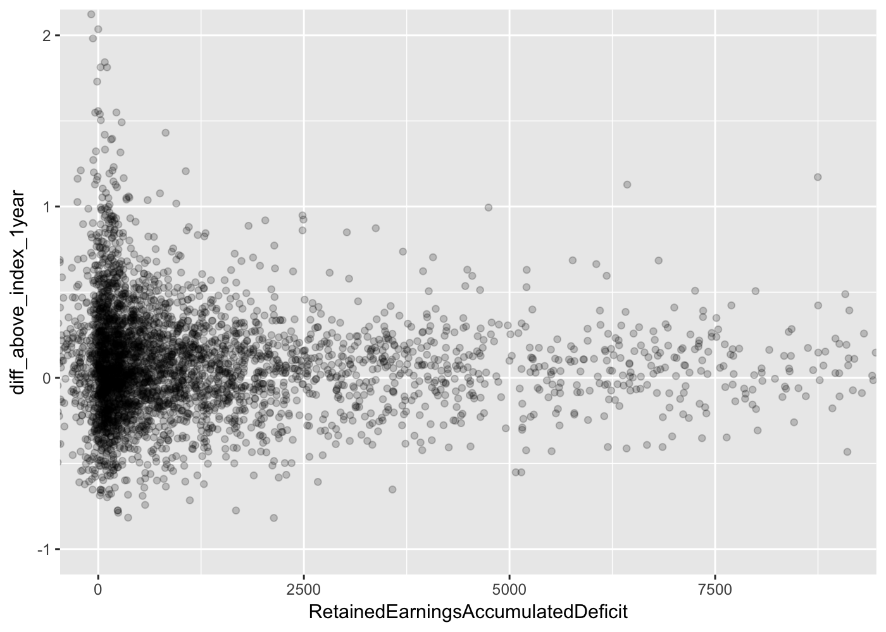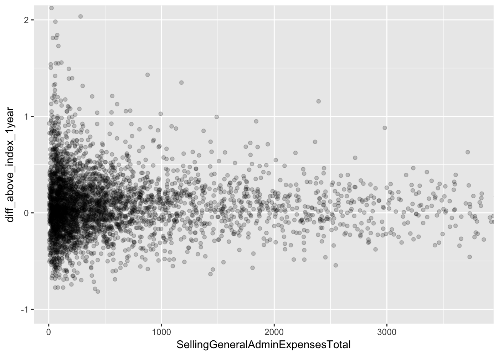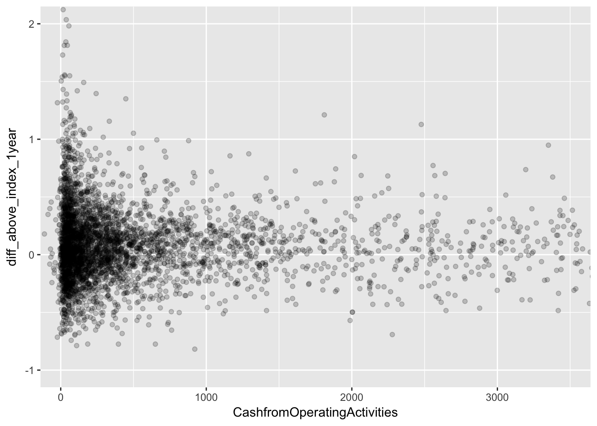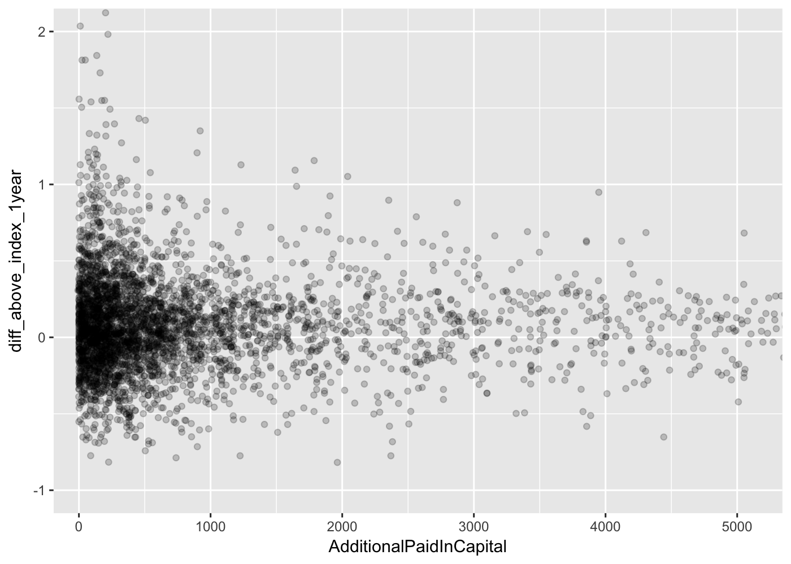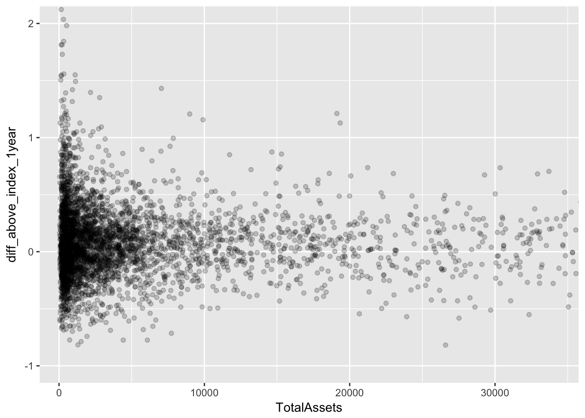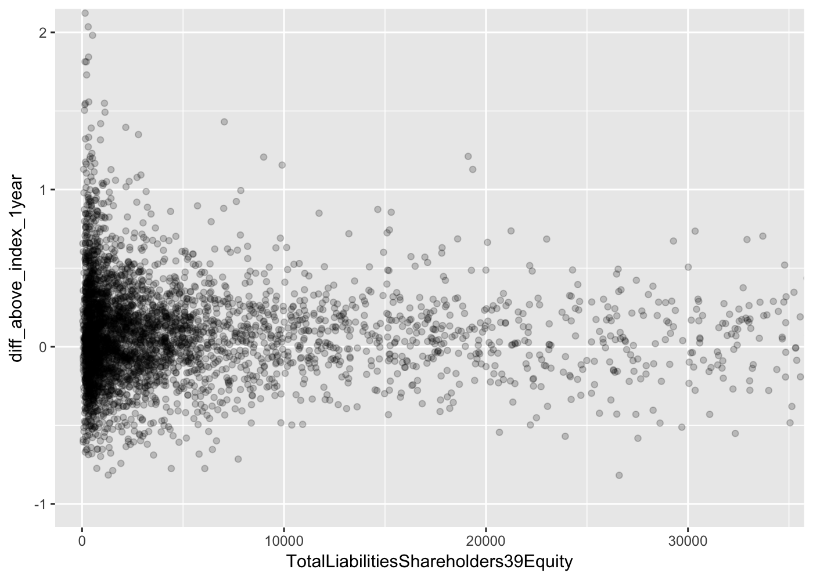

> No clear linear patterns found (visually), which is interesting.

Segmentation and Clustering
---------------------------

-   Before we get into prediction, I'm wondering if there distinguishable segments that we could organic the stocks into, from which patterns (in the dependent variables) would would arise.
-   I'm going to try to leave the dependent variables out (e.g. `perc_change_stock_1year`) and then add them back in after clusting (because presumably if we would like to use clustering to aid in prediction, we would have to cluster on only the independent variables that we would have at the time of clustering/prediction).

> I will be using hierarchical clustering, primarily because k-means clustering starts with a random choice of cluster center and, therefore, will most likely yield different results each time it is ran (with the same data). Hierarchical will most likely be more consistent.
>
> I'll attempt to cluster on common size ratios as well as some of the more common ratios

### Common Size Clustering

-   I'll start with all `cs_` columns, but I'll probably scale down and pick specific columns based on high MIC scorees and common sense

<!-- -->

    ## > ideal number of clusters: 3

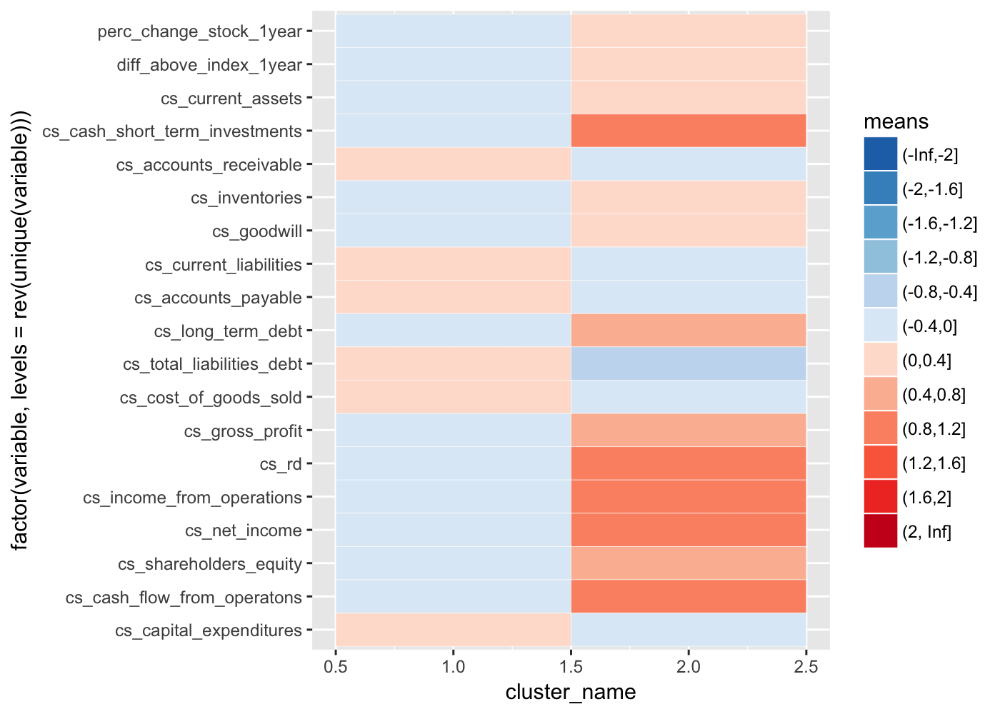

    ## 
    ## 
    ##  cluster      n   perc_change_mean   perc_change_sd   diff_above_index_mean   diff_above_index_sd
    ## --------  -----  -----------------  ---------------  ----------------------  --------------------
    ##        1   3418          0.1562975        0.3488093               0.0807679             0.3193454
    ##        2    910          0.1777161        0.3636924               0.0988485             0.3377206

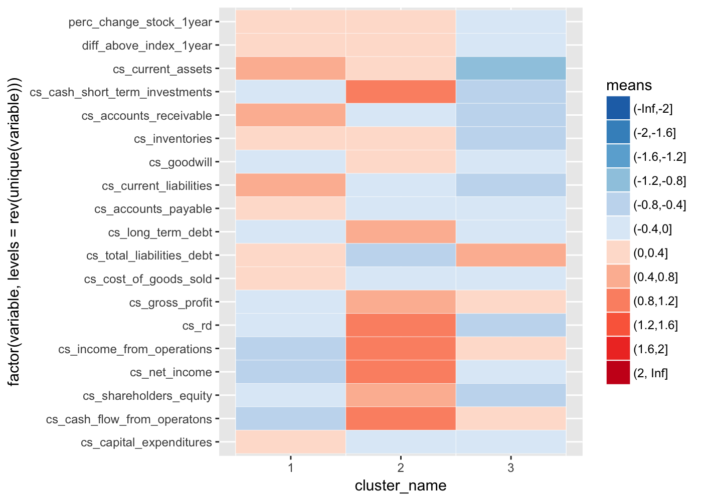

    ## 
    ## 
    ##  cluster      n   perc_change_mean   perc_change_sd   diff_above_index_mean   diff_above_index_sd
    ## --------  -----  -----------------  ---------------  ----------------------  --------------------
    ##        1   2121          0.1780706        0.3914356               0.1018741             0.3584454
    ##        2    910          0.1777161        0.3636924               0.0988485             0.3377206
    ##        3   1297          0.1206918        0.2609621               0.0462526             0.2383013


    ## 
    ## 
    ##  cluster      n   perc_change_mean   perc_change_sd   diff_above_index_mean   diff_above_index_sd
    ## --------  -----  -----------------  ---------------  ----------------------  --------------------
    ##        1    751          0.0955809        0.2880585               0.0218422             0.2584206
    ##        2   1370          0.2232894        0.4313208               0.1457456             0.3961569
    ##        3    910          0.1777161        0.3636924               0.0988485             0.3377206
    ##        4   1297          0.1206918        0.2609621               0.0462526             0.2383013

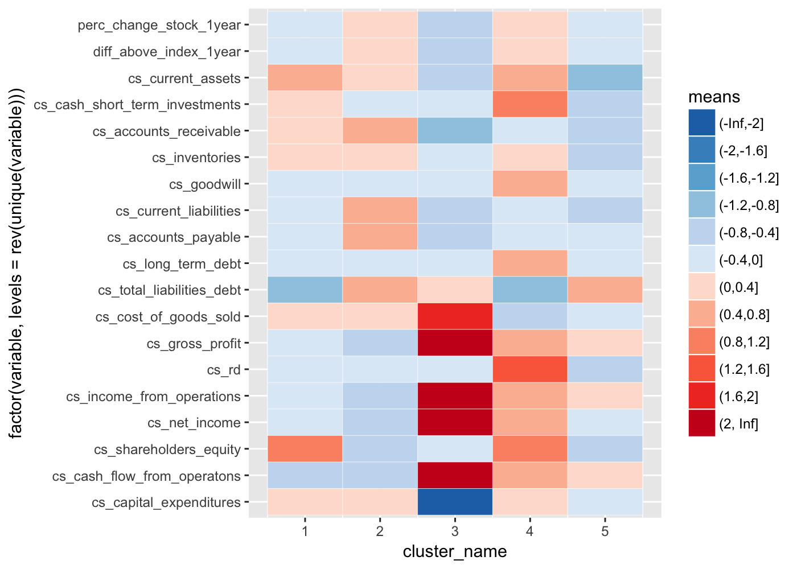

    ## 
    ## 
    ##  cluster      n   perc_change_mean   perc_change_sd   diff_above_index_mean   diff_above_index_sd
    ## --------  -----  -----------------  ---------------  ----------------------  --------------------
    ##        1    751          0.0955809        0.2880585               0.0218422             0.2584206
    ##        2   1370          0.2232894        0.4313208               0.1457456             0.3961569
    ##        3    134          0.0182889        0.3594468              -0.0526408             0.3358351
    ##        4    776          0.2052460        0.3575138               0.1250077             0.3313112
    ##        5   1297          0.1206918        0.2609621               0.0462526             0.2383013

    ## > ideal number of clusters: 3


    ## 
    ## 
    ##  cluster      n   perc_change_mean   perc_change_sd   diff_above_index_mean   diff_above_index_sd
    ## --------  -----  -----------------  ---------------  ----------------------  --------------------
    ##        1   4105          0.1665133        0.3567358               0.0902197             0.3275626
    ##        2    223          0.0556469        0.2268840              -0.0194400             0.2067603


    ## 
    ## 
    ##  cluster      n   perc_change_mean   perc_change_sd   diff_above_index_mean   diff_above_index_sd
    ## --------  -----  -----------------  ---------------  ----------------------  --------------------
    ##        1   3098          0.2784576        0.3301204               0.1913596             0.3052055
    ##        2   1007         -0.1778793        0.1623267              -0.2209338             0.1501379
    ##        3    223          0.0556469        0.2268840              -0.0194400             0.2067603


    ## 
    ## 
    ##  cluster      n   perc_change_mean   perc_change_sd   diff_above_index_mean   diff_above_index_sd
    ## --------  -----  -----------------  ---------------  ----------------------  --------------------
    ##        1   2619          0.1814045        0.2081658               0.1031979             0.1904311
    ##        2   1007         -0.1778793        0.1623267              -0.2209338             0.1501379
    ##        3    479          0.8091095        0.3673732               0.6733963             0.3598331
    ##        4    223          0.0556469        0.2268840              -0.0194400             0.2067603


    ## 
    ## 
    ##  cluster      n   perc_change_mean   perc_change_sd   diff_above_index_mean   diff_above_index_sd
    ## --------  -----  -----------------  ---------------  ----------------------  --------------------
    ##        1   1968          0.1956608        0.1606965               0.1175918             0.1479831
    ##        2   1007         -0.1778793        0.1623267              -0.2209338             0.1501379
    ##        3    479          0.8091095        0.3673732               0.6733963             0.3598331
    ##        4    223          0.0556469        0.2268840              -0.0194400             0.2067603
    ##        5    651          0.1383070        0.3064487               0.0596845             0.2779691

> It will be an interesting experiment to divide the stocks up by cluster to see if machine learning algorithms predict better when focusing on clustered data. The drawback will be a reduced test/training set.

------------------------------------------------------------------------

Sandbox / TODO
==============

``` r
ggplot(data = df_stocks_full, mapping = aes(x = DividendsperShareCommonStockPrimaryIssue, y = perc_change_stock_1year)) +
    geom_point(alpha=0.2)
```

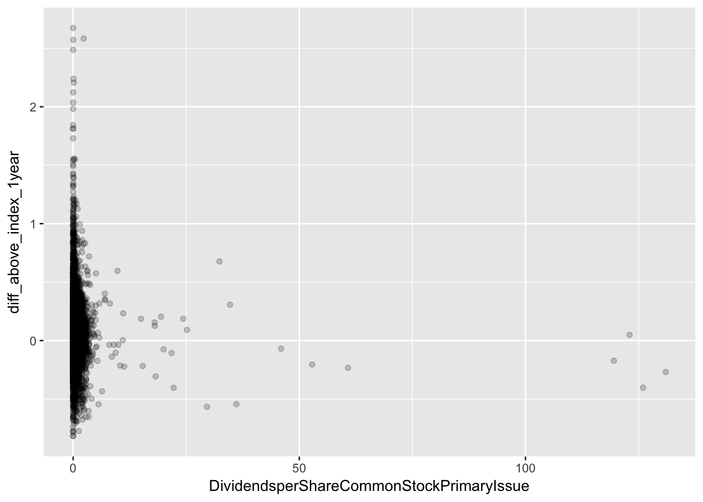

``` r
ggplot(data = df_stocks_full, mapping = aes(x = ratios_quick_ratio, y = perc_change_stock_1year)) +
    geom_point(alpha=0.2)
```


``` r
ggplot(data = df_stocks_full, mapping = aes(x = TotalRevenue, y = perc_change_stock_1year)) +
    geom_point(alpha=0.2)
```

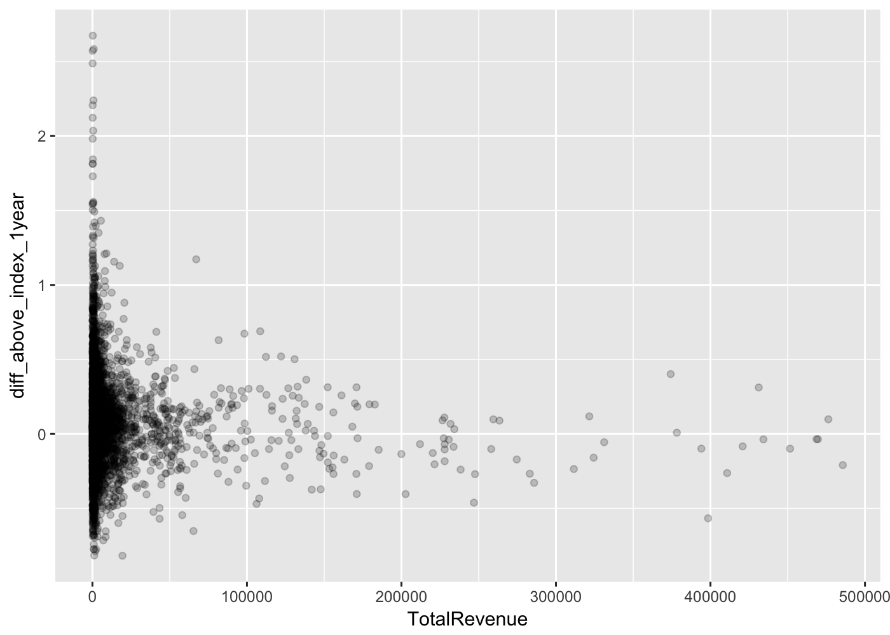

``` r
# makes sense that revenue isn't necessarily correlated with perc_change_stock_1year becuase revenue doesn't guarantee success or profit

ggplot(data = df_stocks_full) +
    geom_hex(mapping = aes(x = TotalRevenue, y = perc_change_stock_1year))
```

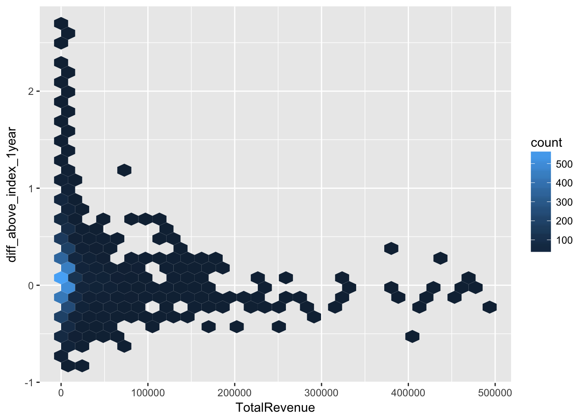

``` r
ggplot(data = df_stocks_full, aes(perc_change_stock_1year)) +
    geom_freqpoly(bins = 15)
```


``` r
# perhaps clustering data will help, since 

ggplot(data = df_stocks_full, mapping = aes(x = net_profit_margin, y = perc_change_stock_1year)) +
    geom_point(alpha=0.2)
```


``` r
# makes sense that revenue isn't necessarily correlated with perc_change_stock_1year becuase revenue doesn't guarantee success or profit

ggplot(data = df_stocks_full) +
    geom_hex(mapping = aes(x = net_profit_margin, y = perc_change_stock_1year))
```


``` r
ggplot(data = df_stocks_full, aes(net_profit_margin)) +
    geom_freqpoly(bins = 15)
```


``` r
# interesting that net profit margin doesn't appear to have any significance in determining perc_change_stock_1year. I would have expected a somewhat linear relationship
```

Datasets
========

``` r
stocks_common_size_perc_change <- df_stocks_full %>% dplyr::select(perc_change_stock_1year, dplyr::contains('cs_'))
stocks_common_size_diff_above_index <- df_stocks_full %>% dplyr::select(diff_above_index_1year, dplyr::contains('cs_'))

stocks_ratios_perc_change <- df_stocks_full %>% dplyr::select(perc_change_stock_1year, dplyr::contains('ratios_'), dplyr::contains('ratioh_'))
stocks_ratios_diff_above_index <- df_stocks_full %>% dplyr::select(diff_above_index_1year, dplyr::contains('ratios_'), dplyr::contains('ratioh_'))

stocks_top_variables_perc_change <- df_stocks_full[, c('perc_change_stock_1year', df_top_variables$variables)]
stocks_top_variables_diff_above_index <- df_stocks_full[, c('diff_above_index_1year', df_top_variables$variables)]

stocks_all_perc_change <- df_stocks_full %>% dplyr::select(-diff_above_index_1year)
stocks_all_diff_above_index <- df_stocks_full %>% dplyr::select(-perc_change_stock_1year)

df_stocks_datasets <- list(stocks_common_size_perc_change, stocks_common_size_diff_above_index, stocks_ratios_perc_change,
    stocks_ratios_diff_above_index, stocks_top_variables_perc_change, stocks_top_variables_diff_above_index, stocks_all_perc_change,
    stocks_all_diff_above_index)
```

Spot Check
==========

-   Based on <http://machinelearningmastery.com/evaluate-machine-learning-algorithms-with-r/>
-   Remove `Low variance columns` (based on <https://campus.datacamp.com/courses/machine-learning-toolbox/preprocessing-your-data?ex=13>):

-   we want to pick the model with the highest average AUC across all ten folds, but we also want a model with a lower standard deviation in AUC

Regression
==========

------------------------------------------------------------------------

Assumptions, Considerations, and Notes
======================================

-   `Consideration`: remove socks with median stock price &lt; $5
-   `Consideration`: the analysis considers the price the day of the financials release, but most likely i won't invest immmediately after financial reporting, so if I do detect a predictable increase, i need to verify that the morjity of increase does not come within days of finnacial release, because that would mean any investment I made would have 'missed the boat'
-   `FUTURE FIX`: The `moving average` fields for closing prices are calculated after adding weekend/holiday dates and closing prices, wihch are filled with the previous day's closing price (in the `add_perc_info` function). So Friday's closing prices, for example, will be weighted more heavily since Sat and Sun will have the same price. I can't easily calculate moving prices before I fill weekend values because I need weekend values to create consistent/precise year lag (and lag value also has a moving average).
-   `FUTURE FIX`: when filtering, perhaps we don't just want to remove individual rows if the row contains invalid data, but perhaps we want to remove all rows for the same stock (chances are this isn't a big deal, because from what I can see, if one year is missing data, all years for that same stock are missing the same amount of data.)
-   `Improvement` - build and incorporate news/social media (e.g. twitter) sentiment and text analysis: <https://www.wunderlist.com/#/tasks/2316044556>
-   `Consideration`: model was built with data from non-recession timeframe.
